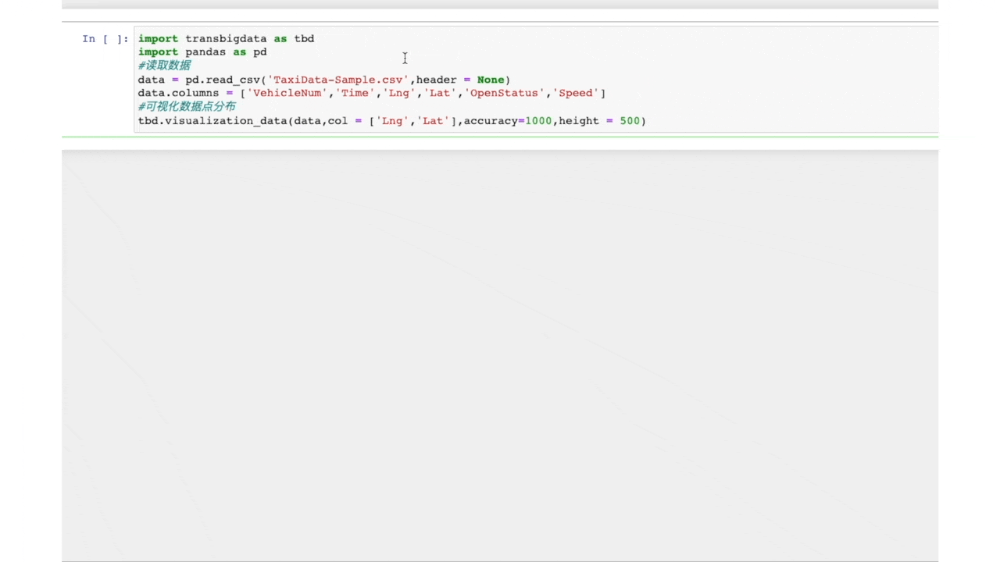
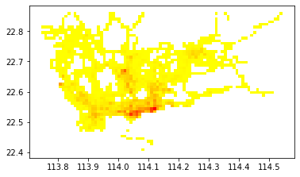
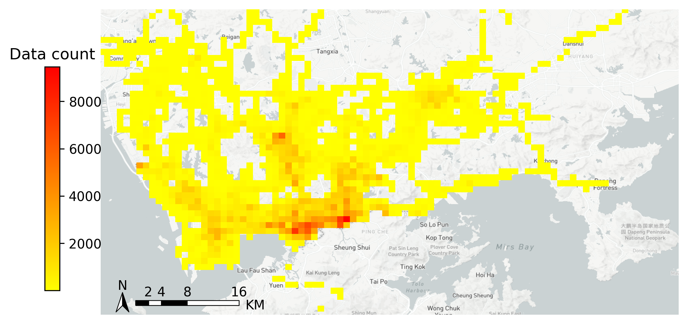

[English](README.md) 中文版

# TransBigData 针对交通时空大数据处理的Python包


[](https://transbigdata.readthedocs.io/en/latest/?badge=latest) [](https://badge.fury.io/py/transbigdata) [](https://pepy.tech/project/transbigdata)  [](https://space.bilibili.com/3051484) [](https://joss.theoj.org/papers/d1055fe3105dfa2dcff4cb6c7688a79b) [](https://mybinder.org/v2/gh/ni1o1/transbigdata/d7d6fa33ff16440ba1698b10dd3cf3f76ff00abd?urlpath=lab%2Ftree%2Fexample%2FExample%201-Taxi%20GPS%20data%20processing.ipynb) [](https://github.com/ni1o1/transbigdata/actions/workflows/tests.yml) [](https://codecov.io/gh/ni1o1/transbigdata) [](https://zenodo.org/badge/latestdoi/419559811) [](https://gitter.im/transbigdata/community?utm_source=badge&utm_medium=badge&utm_campaign=pr-badge)


`TransBigData`是一个为交通时空大数据处理、分析和可视化而开发的Python包。`TransBigData`为处理常见的交通时空大数据（如出租车GPS数据、共享单车数据和公交车GPS数据）提供了快速而简洁的方法。`TransBigData`为交通时空大数据分析的各个阶段提供了多种处理方法,代码简洁、高效、灵活、易用，可以用简洁的代码实现复杂的数据任务。

对于一些特定类型的数据，`TransBigData`还提供了针对特定需求的工具，如从出租车GPS数据中提取出租车行程的起点和终点信息（OD），从公交车GPS数据中识别到离站信息。该包的最新稳定版本可以通过pip安装，完整的文档可以查看：[TransBigData的说明文档](https://transbigdata.readthedocs.io/zh_CN/latest/)

**技术特点**

* 面向交通时空大数据分析不同阶段的处理需求提供不同处理功能。
* 代码简洁、高效、灵活、易用，通过简短的代码即可实现复杂的数据任务。


**主要功能**

目前，`TransBigData`主要提供以下方法:

* **数据质量分析**: 提供快速获取数据集一般信息的方法，包括数据量、时间段和采样间隔。
* **数据预处理**: 提供清洗多种类型的数据错误的方法。
* **数据栅格化**: 提供在研究区域内生成多种类型的地理网格（矩形网格、六角形网格）的方法。提供快速算法将GPS数据映射到生成的网格上。
* **数据聚合集计**: 提供将GPS数据和OD数据聚合到地理多边形的方法。
* **数据可视化**: 内置的可视化功能，利用可视化包keplergl，用简单的代码在Jupyter笔记本上交互式地可视化数据。
* **轨迹数据处理**: 提供处理轨迹数据的方法，包括从GPS点生成轨迹线型，轨迹增密等。
* **地图底图**: 提供在matplotlib上显示Mapbox地图底图的方法。

## 安装

### 用pypi安装

在安装`TransBigData`之前，请确保已经安装了可用的geopandas包：https://geopandas.org/index.html  
如果你已经安装了geopandas，则直接在命令提示符中运行下面代码即可安装：

    pip install -U transbigdata

### 用conda-forge安装

你也可以用conda-forge安装`TransBigData`，这种方式会自动解决环境依赖，不过国内可能需要更换conda源。运行下面代码即可安装：

    conda install -c conda-forge transbigdata

## 可视化示例

### 可视化轨迹(基于keplergl)


### 可视化数据分布(基于keplergl)



### 可视化OD(基于keplergl)


## 使用示例

下面例子展示如何使用`TransBigData`工具快速处理出租车GPS数据，实现数据栅格化，数据聚合集计与数据可视化:

```python
import transbigdata as tbd
import pandas as pd
#读取出租车GPS数据 
data = pd.read_csv('TaxiData-Sample.csv',header = None) 
data.columns = ['VehicleNum','time','lon','lat','OpenStatus','Speed'] 
data
```

<div>
<table border="1" class="dataframe">
  <thead>
    <tr style="text-align: right;">
      <th></th>
      <th>VehicleNum</th>
      <th>time</th>
      <th>lon</th>
      <th>lat</th>
      <th>OpenStatus</th>
      <th>Speed</th>
    </tr>
  </thead>
  <tbody>
    <tr>
      <th>0</th>
      <td>34745</td>
      <td>20:27:43</td>
      <td>113.806847</td>
      <td>22.623249</td>
      <td>1</td>
      <td>27</td>
    </tr>
    <tr>
      <th>1</th>
      <td>34745</td>
      <td>20:24:07</td>
      <td>113.809898</td>
      <td>22.627399</td>
      <td>0</td>
      <td>0</td>
    </tr>
    <tr>
      <th>2</th>
      <td>34745</td>
      <td>20:24:27</td>
      <td>113.809898</td>
      <td>22.627399</td>
      <td>0</td>
      <td>0</td>
    </tr>
    <tr>
      <th>3</th>
      <td>34745</td>
      <td>20:22:07</td>
      <td>113.811348</td>
      <td>22.628067</td>
      <td>0</td>
      <td>0</td>
    </tr>
    <tr>
      <th>4</th>
      <td>34745</td>
      <td>20:10:06</td>
      <td>113.819885</td>
      <td>22.647800</td>
      <td>0</td>
      <td>54</td>
    </tr>
    <tr>
      <th>...</th>
      <td>...</td>
      <td>...</td>
      <td>...</td>
      <td>...</td>
      <td>...</td>
      <td>...</td>
    </tr>
    <tr>
      <th>544994</th>
      <td>28265</td>
      <td>21:35:13</td>
      <td>114.321503</td>
      <td>22.709499</td>
      <td>0</td>
      <td>18</td>
    </tr>
    <tr>
      <th>544995</th>
      <td>28265</td>
      <td>09:08:02</td>
      <td>114.322701</td>
      <td>22.681700</td>
      <td>0</td>
      <td>0</td>
    </tr>
    <tr>
      <th>544996</th>
      <td>28265</td>
      <td>09:14:31</td>
      <td>114.336700</td>
      <td>22.690100</td>
      <td>0</td>
      <td>0</td>
    </tr>
    <tr>
      <th>544997</th>
      <td>28265</td>
      <td>21:19:12</td>
      <td>114.352600</td>
      <td>22.728399</td>
      <td>0</td>
      <td>0</td>
    </tr>
    <tr>
      <th>544998</th>
      <td>28265</td>
      <td>19:08:06</td>
      <td>114.137703</td>
      <td>22.621700</td>
      <td>0</td>
      <td>0</td>
    </tr>
  </tbody>
</table>
<p>544999 rows × 6 columns</p>
</div>


### 数据预处理

首先定义研究范围，并使用`tbd.clean_outofbounds`剔除研究范围外的数据

```python
#定义研究范围
bounds = [113.75, 22.4, 114.62, 22.86]
#剔除研究范围外的数据
data = tbd.clean_outofbounds(data,bounds = bounds,col = ['lon','lat'])
```

### 数据栅格化

以栅格形式表达数据分布是最基本的表达方法。GPS数据经过栅格化后，每个数据点都含有对应的栅格信息，采用栅格表达数据的分布时，其表示的分布情况与真实情况接近。如果要使用`TransBigData`工具进行栅格划分，首先需要确定栅格化的参数（可以理解为定义了一个栅格坐标系），参数可以帮助我们快速进行栅格化:

```python
#获取栅格化参数
params = tbd.grid_params(bounds,accuracy = 1000)
```

取得栅格化参数后，将GPS对应至栅格。使用`tbd.GPS_to_grids`方法,该方法会生成`LONCOL`列与`LATCOL`列，并由这两列共同指定一个栅格:

```python
#将GPS数据对应至栅格
data['LONCOL'],data['LATCOL'] = tbd.GPS_to_grids(data['lon'],data['lat'],params)
```

聚合集计栅格内数据量，并为栅格生成几何图形：

```python
#聚合集计栅格内数据量
grid_agg = data.groupby(['LONCOL','LATCOL'])['VehicleNum'].count().reset_index()
#生成栅格的几何图形
grid_agg['geometry'] = tbd.gridid_to_polygon(grid_agg['LONCOL'],grid_agg['LATCOL'],params)
#转换为GeoDataFrame
import geopandas as gpd
grid_agg = gpd.GeoDataFrame(grid_agg)
#绘制栅格
grid_agg.plot(column = 'VehicleNum',cmap = 'autumn_r')
```


    

### 数据可视化(在matplotlib中绘制地图底图)

对于一个正式的数据可视化图来说，我们还需要添加底图、色条、指北针和比例尺。 用`tbd.plot_map`加载地图底图，并用`tbd.plotscale`添加指北针和比例尺:

```python
import matplotlib.pyplot as plt
fig =plt.figure(1,(8,8),dpi=300)
ax =plt.subplot(111)
plt.sca(ax)
#加载地图底图
tbd.plot_map(plt,bounds,zoom = 11,style = 4)
#定义色条位置
cax = plt.axes([0.05, 0.33, 0.02, 0.3])
plt.title('Data count')
plt.sca(ax)
#绘制数据
grid_agg.plot(column = 'VehicleNum',cmap = 'autumn_r',ax = ax,cax = cax,legend = True)
#添加指北针和比例尺
tbd.plotscale(ax,bounds = bounds,textsize = 10,compasssize = 1,accuracy = 2000,rect = [0.06,0.03],zorder = 10)
plt.axis('off')
plt.xlim(bounds[0],bounds[2])
plt.ylim(bounds[1],bounds[3])
plt.show()
```

    

    


## 相关链接

* 小旭学长的b站： https://space.bilibili.com/3051484
* 小旭学长的七天入门交通时空大数据分析课程（零基础免费课）： https://www.lifangshuju.com/#/introduce/166  
* 小旭学长的交通时空大数据分析课程： https://www.lifangshuju.com/#/introduce/154  
* 小旭学长的数据可视化课程： https://www.lifangshuju.com/#/introduce/165  
* 本项目的github页面： https://github.com/ni1o1/transbigdata/  
* 有bug请在这个页面提交： https://github.com/ni1o1/transbigdata/issues  

## 引用信息
如果你想要引用`TransBigData`，请引用[这个DOI](https://doi.org/10.5281/zenodo.5912101)，引用信息在这个文件中[CITATION.cff](https://github.com/ni1o1/transbigdata/blob/main/CITATION.cff)。

## 介绍视频

* [Bilibili](https://www.bilibili.com/video/BV1nq4y1u7i1)
* [Youtube](https://www.youtube.com/watch?v=V_KHFv75W_w)
