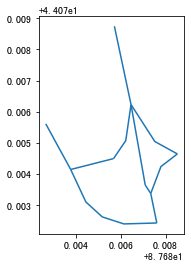
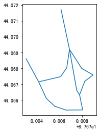

.. _CoordinatesConverter:

******************************
坐标与距离
******************************

火星坐标系互转
=============================

坐标互转方法
--------------------------

TransBigData包提供了GCJ02,BD09,BD09mc,WGS94坐标系互转。

.. function:: transbigdata.gcj02tobd09(lng, lat)

.. function:: transbigdata.bd09togcj02(bd_lon, bd_lat)

.. function:: transbigdata.wgs84togcj02(lng, lat)

.. function:: transbigdata.gcj02towgs84(lng, lat)

.. function:: transbigdata.wgs84tobd09(lon,lat)

.. function:: transbigdata.bd09towgs84(lon,lat)

.. function:: transbigdata.bd09mctobd09(lon,lat)

坐标互转，基于numpy列运算::

  data['Lng'],data['Lat'] = tbd.wgs84tobd09(data['Lng'],data['Lat'])  
  data['Lng'],data['Lat'] = tbd.wgs84togcj02(data['Lng'],data['Lat'])  
  data['Lng'],data['Lat'] = tbd.gcj02tobd09(data['Lng'],data['Lat'])  
  data['Lng'],data['Lat'] = tbd.gcj02towgs84(data['Lng'],data['Lat'])  
  data['Lng'],data['Lat'] = tbd.bd09togcj02(data['Lng'],data['Lat'])  
  data['Lng'],data['Lat'] = tbd.bd09towgs84(data['Lng'],data['Lat'])  
  data['Lng'],data['Lat'] = tbd.bd09mctobd09(data['Lng'],data['Lat']) 

对地理要素转换坐标
--------------------------

.. function:: transbigdata.transform_shape(gdf,method)

输入地理要素的GeoDataFrame，对整体做坐标转换

**输入**

gdf : GeoDataFrame
    地理要素
method : function
    坐标转换函数

**输出**

gdf : GeoDataFrame
    转换后结果

::

    #读取线要素
    import geopandas as gpd
    Centerline = gpd.read_file(r'test_lines.json')
    Centerline.plot()

::

    #整体进行坐标转换
    import transbigdata as tbd
    Centerline_transformed = tbd.transform_shape(Centerline,tbd.bd09towgs84)
    Centerline_transformed.plot()

经纬度计算距离
=============================

.. function:: transbigdata.getdistance(lon1, lat1, lon2, lat2)

按经度1，纬度1，经度2，纬度2 （十进制度数）顺序输入起终点经纬度，为DataFrame的列，获取距离（米），基于numpy列运算::
    
  data['distance'] = tbd.getdistance(data['Lng1'],data['Lat1'], data['Lng2'],data['Lat2'])  

