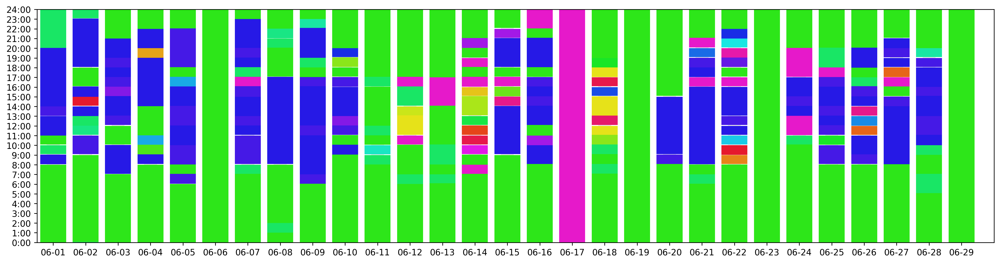

Mobile phone data processing
=================================

| In this example, we will introduce how to use the TransBigData to
  process mobile phone data.
| Firstly, import the TransBigData and read the data using pandas

::

    import pandas as pd
    import numpy as np
    import geopandas as gpd
    import transbigdata as tbd
    
    data = pd.read_csv(r'data/mobiledata_sample.csv')
    #make sure the time column is correct
    data['stime'] = pd.to_datetime(data['stime'], format='%Y%m%d%H%M')
    
    data.head()

.. raw:: html

    

    
    <table border="1" class="dataframe">
      <thead>
        <tr style="text-align: right;">
          <th></th>
          <th>user_id</th>
          <th>stime</th>
          <th>longitude</th>
          <th>latitude</th>
          <th>date</th>
        </tr>
      </thead>
      <tbody>
        <tr>
          <th>0</th>
          <td>a93c8222bae0e0abe45672088c961e44</td>
          <td>2018-06-16 18:01:02</td>
          <td>119.704</td>
          <td>30.634</td>
          <td>20180616</td>
        </tr>
        <tr>
          <th>1</th>
          <td>a93c8222bae0e0abe45672088c961e44</td>
          <td>2018-06-16 14:01:02</td>
          <td>119.704</td>
          <td>30.634</td>
          <td>20180616</td>
        </tr>
        <tr>
          <th>2</th>
          <td>a93c8222bae0e0abe45672088c961e44</td>
          <td>2018-06-16 06:00:07</td>
          <td>119.708</td>
          <td>30.630</td>
          <td>20180616</td>
        </tr>
        <tr>
          <th>3</th>
          <td>a93c8222bae0e0abe45672088c961e44</td>
          <td>2018-06-16 19:00:06</td>
          <td>119.704</td>
          <td>30.634</td>
          <td>20180616</td>
        </tr>
        <tr>
          <th>4</th>
          <td>a93c8222bae0e0abe45672088c961e44</td>
          <td>2018-06-16 08:03:01</td>
          <td>119.704</td>
          <td>30.634</td>
          <td>20180616</td>
        </tr>
      </tbody>
    </table>
    

Identify stay and move infomation from mobile phone trajectory data
-------------------------------------------------------------------

When processing mobile phone data, TransBigData’s approach is to first
correspond the data to the grids and treat the data within the same grid
as being at the same location to avoid data positioning errors that
cause the same location to be identified as multiple.
处理手机数据时，TransBigData的方法是先将数据对应至栅格，将同一个栅格内的数据视为在同一个位置，以避免数据定位误差导致同一位置被识别为多个。

::

    #Obtain gridding parameters
    params = tbd.area_to_params([121.860, 29.295, 121.862, 29.301], accuracy=500)
    #Identify stay and move infomation from mobile phone trajectory data
    stay,move = tbd.mobile_stay_move(data,params,col = ['user_id','stime','longitude', 'latitude'])

::

    stay.head()

.. raw:: html

    

    
    <table border="1" class="dataframe">
      <thead>
        <tr style="text-align: right;">
          <th></th>
          <th>user_id</th>
          <th>stime</th>
          <th>LONCOL</th>
          <th>LATCOL</th>
          <th>etime</th>
          <th>lon</th>
          <th>lat</th>
          <th>duration</th>
        </tr>
      </thead>
      <tbody>
        <tr>
          <th>0</th>
          <td>00466ab30de56db7efbd04991b680ae1</td>
          <td>2018-06-01 00:00:00</td>
          <td>-83</td>
          <td>196</td>
          <td>2018-06-01 07:02:01</td>
          <td>121.432040</td>
          <td>30.176335</td>
          <td>25321.0</td>
        </tr>
        <tr>
          <th>1</th>
          <td>00466ab30de56db7efbd04991b680ae1</td>
          <td>2018-06-01 07:03:06</td>
          <td>-81</td>
          <td>191</td>
          <td>2018-06-01 12:00:02</td>
          <td>121.442352</td>
          <td>30.153852</td>
          <td>17816.0</td>
        </tr>
        <tr>
          <th>2</th>
          <td>00466ab30de56db7efbd04991b680ae1</td>
          <td>2018-06-01 12:02:00</td>
          <td>-83</td>
          <td>196</td>
          <td>2018-06-01 13:00:04</td>
          <td>121.432040</td>
          <td>30.176335</td>
          <td>3484.0</td>
        </tr>
        <tr>
          <th>3</th>
          <td>00466ab30de56db7efbd04991b680ae1</td>
          <td>2018-06-01 13:05:08</td>
          <td>-60</td>
          <td>187</td>
          <td>2018-06-01 14:00:00</td>
          <td>121.550631</td>
          <td>30.135865</td>
          <td>3292.0</td>
        </tr>
        <tr>
          <th>4</th>
          <td>00466ab30de56db7efbd04991b680ae1</td>
          <td>2018-06-01 14:03:04</td>
          <td>-60</td>
          <td>189</td>
          <td>2018-06-01 18:01:03</td>
          <td>121.550631</td>
          <td>30.144858</td>
          <td>14279.0</td>
        </tr>
      </tbody>
    </table>
    

::

    move.head()

.. raw:: html

    

    
    <table border="1" class="dataframe">
      <thead>
        <tr style="text-align: right;">
          <th></th>
          <th>user_id</th>
          <th>SLONCOL</th>
          <th>SLATCOL</th>
          <th>stime</th>
          <th>slon</th>
          <th>slat</th>
          <th>etime</th>
          <th>elon</th>
          <th>elat</th>
          <th>ELONCOL</th>
          <th>ELATCOL</th>
          <th>duration</th>
        </tr>
      </thead>
      <tbody>
        <tr>
          <th>0</th>
          <td>00466ab30de56db7efbd04991b680ae1</td>
          <td>-83</td>
          <td>196</td>
          <td>2018-06-01 07:02:01</td>
          <td>121.432040</td>
          <td>30.176335</td>
          <td>2018-06-01 07:03:06</td>
          <td>121.442352</td>
          <td>30.153852</td>
          <td>-81.0</td>
          <td>191.0</td>
          <td>65.0</td>
        </tr>
        <tr>
          <th>1</th>
          <td>00466ab30de56db7efbd04991b680ae1</td>
          <td>-81</td>
          <td>191</td>
          <td>2018-06-01 12:00:02</td>
          <td>121.442352</td>
          <td>30.153852</td>
          <td>2018-06-01 12:02:00</td>
          <td>121.432040</td>
          <td>30.176335</td>
          <td>-83.0</td>
          <td>196.0</td>
          <td>118.0</td>
        </tr>
        <tr>
          <th>2</th>
          <td>00466ab30de56db7efbd04991b680ae1</td>
          <td>-83</td>
          <td>196</td>
          <td>2018-06-01 13:00:04</td>
          <td>121.432040</td>
          <td>30.176335</td>
          <td>2018-06-01 13:05:08</td>
          <td>121.550631</td>
          <td>30.135865</td>
          <td>-60.0</td>
          <td>187.0</td>
          <td>304.0</td>
        </tr>
        <tr>
          <th>3</th>
          <td>00466ab30de56db7efbd04991b680ae1</td>
          <td>-60</td>
          <td>187</td>
          <td>2018-06-01 14:00:00</td>
          <td>121.550631</td>
          <td>30.135865</td>
          <td>2018-06-01 14:03:04</td>
          <td>121.550631</td>
          <td>30.144858</td>
          <td>-60.0</td>
          <td>189.0</td>
          <td>184.0</td>
        </tr>
        <tr>
          <th>4</th>
          <td>00466ab30de56db7efbd04991b680ae1</td>
          <td>-60</td>
          <td>189</td>
          <td>2018-06-01 18:01:03</td>
          <td>121.550631</td>
          <td>30.144858</td>
          <td>2018-06-01 18:04:03</td>
          <td>121.432040</td>
          <td>30.176335</td>
          <td>-83.0</td>
          <td>196.0</td>
          <td>180.0</td>
        </tr>
      </tbody>
    </table>
    

Home and work place identify
----------------------------

::

    #Identify home location
    home = tbd.mobile_identify_home(stay, col=['user_id','stime', 'etime','LONCOL', 'LATCOL','lon','lat'], start_hour=8, end_hour=20 )
    home.head()

.. raw:: html

    

    
    <table border="1" class="dataframe">
      <thead>
        <tr style="text-align: right;">
          <th></th>
          <th>user_id</th>
          <th>LONCOL</th>
          <th>LATCOL</th>
          <th>lon</th>
          <th>lat</th>
        </tr>
      </thead>
      <tbody>
        <tr>
          <th>3324</th>
          <td>fcc3a9e9df361667e00ee5c16cb08922</td>
          <td>-147</td>
          <td>292</td>
          <td>121.102046</td>
          <td>30.608009</td>
        </tr>
        <tr>
          <th>3303</th>
          <td>f71e9d7d78e6f5bc9539d141e3a5a1c4</td>
          <td>-216</td>
          <td>330</td>
          <td>120.746272</td>
          <td>30.778880</td>
        </tr>
        <tr>
          <th>3273</th>
          <td>f6b65495b63574c2eb73c7e63ae38252</td>
          <td>-225</td>
          <td>-286</td>
          <td>120.699867</td>
          <td>28.008971</td>
        </tr>
        <tr>
          <th>3237</th>
          <td>f1f4224a60da630a0b83b3a231022123</td>
          <td>102</td>
          <td>157</td>
          <td>122.385927</td>
          <td>30.000967</td>
        </tr>
        <tr>
          <th>3181</th>
          <td>e96739aedb70a8e5c4efe4c488934b43</td>
          <td>-223</td>
          <td>278</td>
          <td>120.710179</td>
          <td>30.545056</td>
        </tr>
      </tbody>
    </table>
    

::

    #Identify work location
    work = tbd.mobile_identify_work(stay, col=['user_id', 'stime', 'etime', 'LONCOL', 'LATCOL','lon','lat'], minhour=3, start_hour=8, end_hour=20,workdaystart=0, workdayend=4)
    work.head()

.. raw:: html

    

    
    <table border="1" class="dataframe">
      <thead>
        <tr style="text-align: right;">
          <th></th>
          <th>user_id</th>
          <th>LONCOL</th>
          <th>LATCOL</th>
          <th>lon</th>
          <th>lat</th>
        </tr>
      </thead>
      <tbody>
        <tr>
          <th>0</th>
          <td>fcc3a9e9df361667e00ee5c16cb08922</td>
          <td>-146</td>
          <td>292</td>
          <td>121.107203</td>
          <td>30.608009</td>
        </tr>
        <tr>
          <th>1</th>
          <td>f71e9d7d78e6f5bc9539d141e3a5a1c4</td>
          <td>-219</td>
          <td>325</td>
          <td>120.730804</td>
          <td>30.756397</td>
        </tr>
        <tr>
          <th>3</th>
          <td>f1f4224a60da630a0b83b3a231022123</td>
          <td>103</td>
          <td>153</td>
          <td>122.391083</td>
          <td>29.982981</td>
        </tr>
        <tr>
          <th>5</th>
          <td>e1a1dfb5a77578c889bd3368ffe1d30f</td>
          <td>-62</td>
          <td>138</td>
          <td>121.540319</td>
          <td>29.915532</td>
        </tr>
        <tr>
          <th>6</th>
          <td>e0e30d88fc4f4b8a1d649baf9dd1274e</td>
          <td>-436</td>
          <td>-35</td>
          <td>119.611920</td>
          <td>29.137619</td>
        </tr>
      </tbody>
    </table>
    

::

    # If you want to filter out the users with work place location from home location 
    home['flag'] = 1
    work = pd.merge(work,home,how='left')
    home = home.drop(['flag'],axis = 1)
    work = work[work['flag'].isnull()].drop(['flag'],axis = 1)

Plot activity
-------------

::

    #Plot the activity of the user, different color represent different location
    uid = work['user_id'].sample().iloc[0]
    tbd.mobile_plot_activity(stay[stay['user_id']==uid],figsize = (20, 5))

