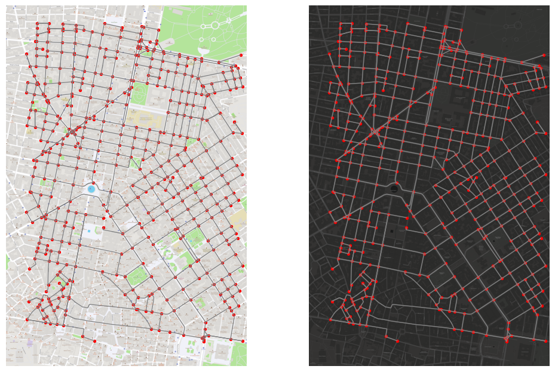
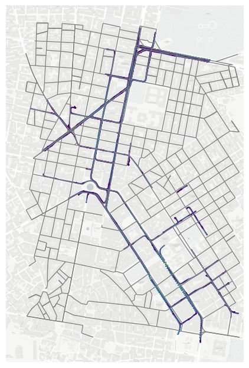
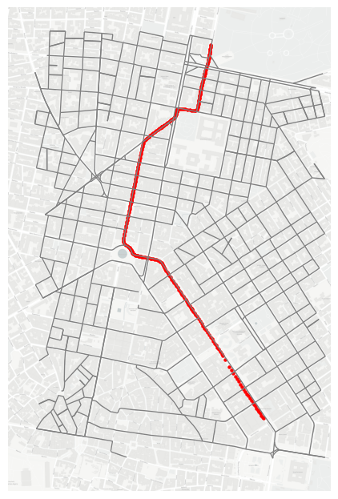

pNEUMA trajectory dataset processing
====================================

| In this example, …the pNEUMA trajectory at Athens will be processed
  and visualized.
| Note that the sample data has been reshaped to a neat form. The origin
  version of pNEUMA dataset can be download at this
  `website <https://open-traffic.epfl.ch/>`__

::

    import transbigdata as tbd
    import pandas as pd
    import geopandas as gpd
    import matplotlib.pyplot as plt

Read the data
-------------

The trajectory data
~~~~~~~~~~~~~~~~~~~

::

    # Read data
    data = pd.read_csv('data/pNEUMA_tbd_sample.csv')
    # Transform the timestamp into Datetime
    data['time'] = pd.to_datetime(data['time'], unit='s')
    data.head()

.. raw:: html

    

    
    <table border="1" class="dataframe">
      <thead>
        <tr style="text-align: right;">
          <th></th>
          <th>track_id</th>
          <th>lon</th>
          <th>lat</th>
          <th>speed</th>
          <th>time</th>
        </tr>
      </thead>
      <tbody>
        <tr>
          <th>0</th>
          <td>128</td>
          <td>23.730362</td>
          <td>37.990046</td>
          <td>12.5845</td>
          <td>1970-01-01 00:00:00.000</td>
        </tr>
        <tr>
          <th>1</th>
          <td>128</td>
          <td>23.730364</td>
          <td>37.990045</td>
          <td>12.4935</td>
          <td>1970-01-01 00:00:00.040</td>
        </tr>
        <tr>
          <th>2</th>
          <td>128</td>
          <td>23.730366</td>
          <td>37.990045</td>
          <td>12.3965</td>
          <td>1970-01-01 00:00:00.080</td>
        </tr>
        <tr>
          <th>3</th>
          <td>128</td>
          <td>23.730367</td>
          <td>37.990045</td>
          <td>12.2949</td>
          <td>1970-01-01 00:00:00.120</td>
        </tr>
        <tr>
          <th>4</th>
          <td>128</td>
          <td>23.730369</td>
          <td>37.990044</td>
          <td>12.1910</td>
          <td>1970-01-01 00:00:00.160</td>
        </tr>
      </tbody>
    </table>
    

::

    # print the file size
    data.info()

.. parsed-literal::

    <class 'pandas.core.frame.DataFrame'>
    RangeIndex: 581244 entries, 0 to 581243
    Data columns (total 5 columns):
     #   Column    Non-Null Count   Dtype         
    ---  ------    --------------   -----         
     0   track_id  581244 non-null  int64         
     1   lon       581244 non-null  float64       
     2   lat       581244 non-null  float64       
     3   speed     581244 non-null  float64       
     4   time      581244 non-null  datetime64[ns]
    dtypes: datetime64[ns](1), float64(3), int64(1)
    memory usage: 22.2 MB

OSM Map Data
~~~~~~~~~~~~

You can load the map data directly from the ``data`` folder or download
it using the `OSMNX package <https://osmnx.readthedocs.io/en/stable/>`__

::

    # Load data from OSMNX
    # OSM Graph
    import osmnx as ox
    bounds = [23.723577, 37.975462, 23.738471, 37.993053]
    north, south, east, west = bounds[3], bounds[1], bounds[2], bounds[0]
    G = ox.graph_from_bbox(north, south, east, west, network_type='drive')
    
    # get the nodes and edges
    nodes, edges = ox.graph_to_gdfs(G, nodes=True, edges=True)
    
    # save/load graph as a graphml file
    filepath = "data/pNEUMA_network.graphml"
    ox.save_graphml(G, filepath)

If you cannot using OSMNX, you can run the code below

::

    # Load the prepared OSM data
    import osmnx as ox
    filepath = "data/pNEUMA_network.graphml"
    G = ox.load_graphml(filepath)
    # get the nodes and edges
    nodes, edges = ox.graph_to_gdfs(G, nodes=True, edges=True)

Basemap Visualization
~~~~~~~~~~~~~~~~~~~~~

Combined with the Graph from OSM

::

    # Map visualization via tbd.plot_map
    bounds = [23.723577, 37.975462, 23.738471, 37.993053]
    
    fig = plt.figure(1, (12, 8), dpi=100)
    ax = plt.subplot(121)
    plt.sca(ax)
    tbd.plot_map(plt, bounds, zoom=18, style=1) # the map
    edges.plot(ax=ax, lw=1, color='grey') # edges
    nodes.plot(ax=ax, markersize = 8, color='red') # nodes
    plt.axis('off');
    
    ax = plt.subplot(122)
    plt.sca(ax)
    tbd.plot_map(plt, bounds, zoom=18, style=5) # the map
    edges.plot(ax=ax, lw=1, color='grey') # edges
    nodes.plot(ax=ax, markersize = 8, color='red') # nodes
    plt.axis('off');

Data Cleaning
-------------

Data Sparisify
~~~~~~~~~~~~~~

| The sampling interval in this dataset is :math:`0.04` second, which is
  amazing.
| However, some marcoscopic studies do not need such a high-frequency
  for better processing efficiency. In this case, the data can be
  sparsified using tbd.XXX.

::

    # the origin data
    data.info()

.. parsed-literal::

    <class 'pandas.core.frame.DataFrame'>
    RangeIndex: 581244 entries, 0 to 581243
    Data columns (total 5 columns):
     #   Column    Non-Null Count   Dtype         
    ---  ------    --------------   -----         
     0   track_id  581244 non-null  int64         
     1   lon       581244 non-null  float64       
     2   lat       581244 non-null  float64       
     3   speed     581244 non-null  float64       
     4   time      581244 non-null  datetime64[ns]
    dtypes: datetime64[ns](1), float64(3), int64(1)
    memory usage: 22.2 MB

::

    data_sparsify = tbd.traj_sparsify(data, col=['track_id', 'time', 'lon', 'lat'], 
                                      timegap=0.4, 
                                      method='subsample') # do not using interpolate method
    data_sparsify.info()

.. parsed-literal::

    <class 'pandas.core.frame.DataFrame'>
    Int64Index: 23293 entries, 0 to 581229
    Data columns (total 5 columns):
     #   Column    Non-Null Count  Dtype         
    ---  ------    --------------  -----         
     0   track_id  23293 non-null  int64         
     1   lon       23293 non-null  float64       
     2   lat       23293 non-null  float64       
     3   speed     23293 non-null  float64       
     4   time      23293 non-null  datetime64[ns]
    dtypes: datetime64[ns](1), float64(3), int64(1)
    memory usage: 1.1 MB

Data compress
~~~~~~~~~~~~~

Remove the stopped points except for the first and the last point for
each vehicle.

::

    # tbd清理中间不动的数据点
    data_sparsify_clean = tbd.clean_same(data_sparsify, col=['track_id', 'time', 'lon', 'lat'])
    data_sparsify_clean.info()

.. parsed-literal::

    <class 'pandas.core.frame.DataFrame'>
    Int64Index: 10674 entries, 0 to 581229
    Data columns (total 5 columns):
     #   Column    Non-Null Count  Dtype         
    ---  ------    --------------  -----         
     0   track_id  10674 non-null  int64         
     1   lon       10674 non-null  float64       
     2   lat       10674 non-null  float64       
     3   speed     10674 non-null  float64       
     4   time      10674 non-null  datetime64[ns]
    dtypes: datetime64[ns](1), float64(3), int64(1)
    memory usage: 500.3 KB

::

    data_sparsify_clean.head()

.. raw:: html

    

    
    <table border="1" class="dataframe">
      <thead>
        <tr style="text-align: right;">
          <th></th>
          <th>track_id</th>
          <th>lon</th>
          <th>lat</th>
          <th>speed</th>
          <th>time</th>
        </tr>
      </thead>
      <tbody>
        <tr>
          <th>0</th>
          <td>128</td>
          <td>23.730362</td>
          <td>37.990046</td>
          <td>12.5845</td>
          <td>1970-01-01 00:00:00</td>
        </tr>
        <tr>
          <th>25</th>
          <td>128</td>
          <td>23.730399</td>
          <td>37.990040</td>
          <td>10.6835</td>
          <td>1970-01-01 00:00:01</td>
        </tr>
        <tr>
          <th>50</th>
          <td>128</td>
          <td>23.730429</td>
          <td>37.990036</td>
          <td>7.8580</td>
          <td>1970-01-01 00:00:02</td>
        </tr>
        <tr>
          <th>75</th>
          <td>128</td>
          <td>23.730443</td>
          <td>37.990033</td>
          <td>1.2661</td>
          <td>1970-01-01 00:00:03</td>
        </tr>
        <tr>
          <th>1775</th>
          <td>128</td>
          <td>23.730443</td>
          <td>37.990033</td>
          <td>0.0027</td>
          <td>1970-01-01 00:01:11</td>
        </tr>
      </tbody>
    </table>
    

Data Visualization
------------------

::

    gdf_data = gpd.GeoDataFrame(data_sparsify_clean, 
                                geometry=gpd.points_from_xy(data_sparsify_clean['lon'], 
                                                            data_sparsify_clean['lat']), 
                                crs=4326)
    gdf_data.head()

.. raw:: html

    

    
    <table border="1" class="dataframe">
      <thead>
        <tr style="text-align: right;">
          <th></th>
          <th>track_id</th>
          <th>lon</th>
          <th>lat</th>
          <th>speed</th>
          <th>time</th>
          <th>geometry</th>
        </tr>
      </thead>
      <tbody>
        <tr>
          <th>0</th>
          <td>128</td>
          <td>23.730362</td>
          <td>37.990046</td>
          <td>12.5845</td>
          <td>1970-01-01 00:00:00</td>
          <td>POINT (23.73036 37.99005)</td>
        </tr>
        <tr>
          <th>25</th>
          <td>128</td>
          <td>23.730399</td>
          <td>37.990040</td>
          <td>10.6835</td>
          <td>1970-01-01 00:00:01</td>
          <td>POINT (23.73040 37.99004)</td>
        </tr>
        <tr>
          <th>50</th>
          <td>128</td>
          <td>23.730429</td>
          <td>37.990036</td>
          <td>7.8580</td>
          <td>1970-01-01 00:00:02</td>
          <td>POINT (23.73043 37.99004)</td>
        </tr>
        <tr>
          <th>75</th>
          <td>128</td>
          <td>23.730443</td>
          <td>37.990033</td>
          <td>1.2661</td>
          <td>1970-01-01 00:00:03</td>
          <td>POINT (23.73044 37.99003)</td>
        </tr>
        <tr>
          <th>1775</th>
          <td>128</td>
          <td>23.730443</td>
          <td>37.990033</td>
          <td>0.0027</td>
          <td>1970-01-01 00:01:11</td>
          <td>POINT (23.73044 37.99003)</td>
        </tr>
      </tbody>
    </table>
    

::

    # get the vehicle list of top-ranked number of points
    gdf_count = gdf_data.groupby('track_id')['lon'].count().rename('count').sort_values(ascending=False).reset_index()
    print(list(gdf_count.iloc[:20]['track_id']))

.. parsed-literal::

    [2138, 3290, 1442, 3197, 4408, 1767, 5002, 5022, 2140, 347, 2584, 4750, 4542, 2431, 4905, 4997, 1329, 4263, 1215, 3400]

Visualization of all vehicles

::

    fig = plt.figure(1, (6, 8), dpi=100)
    
    ax = plt.subplot(111)
    plt.sca(ax)
    
    # map
    tbd.plot_map(plt, bounds, zoom=18, style=4) # the map
    edges.plot(ax=ax, lw=1, color='grey') # edges
    # nodes.plot(ax=ax, markersize = 6, color='red') # nodes
    
    # trajectory
    gdf_data.plot(column='speed', ax=ax, markersize=0.5)
    
    plt.axis('off');

Visualization of a single vehicle, and show the shortes path

::

    # select a vehicle
    tmpgdf_data = gdf_data[gdf_data['track_id']==2138]
    
    # the origin / destination location
    # o_point = [tmpgdf_data.iloc[0]['lon'], tmpgdf_data.iloc[0]['lat']]
    # d_point = [tmpgdf_data.iloc[-1]['lon'], tmpgdf_data.iloc[-1]['lat']]
    
    # get the nearest node of each point on the map
    tmpgdf_data = tbd.ckdnearest_point(tmpgdf_data, nodes)
    
    # extract the o/d node
    o_index, d_index = tmpgdf_data.iloc[0]['index'], tmpgdf_data.iloc[-1]['index']
    o_node_id, d_node_id = list(nodes[nodes['index']==o_index].index)[0], \
                           list(nodes[nodes['index']==d_index].index)[0]
    print(o_node_id, d_node_id)
    
    tmpgdf_data.head()

.. parsed-literal::

    250691723 358465943

.. parsed-literal::

    /Applications/anaconda3/envs/data/lib/python3.6/site-packages/geopandas/geodataframe.py:1322: SettingWithCopyWarning: 
    A value is trying to be set on a copy of a slice from a DataFrame.
    Try using .loc[row_indexer,col_indexer] = value instead
    
    See the caveats in the documentation: https://pandas.pydata.org/pandas-docs/stable/user_guide/indexing.html#returning-a-view-versus-a-copy
      super(GeoDataFrame, self).__setitem__(key, value)

.. raw:: html

    

    
    <table border="1" class="dataframe">
      <thead>
        <tr style="text-align: right;">
          <th></th>
          <th>track_id</th>
          <th>lon</th>
          <th>lat</th>
          <th>speed</th>
          <th>time</th>
          <th>geometry_x</th>
          <th>dist</th>
          <th>index</th>
          <th>y</th>
          <th>x</th>
          <th>street_count</th>
          <th>highway</th>
          <th>geometry_y</th>
        </tr>
      </thead>
      <tbody>
        <tr>
          <th>0</th>
          <td>2138</td>
          <td>23.735287</td>
          <td>37.977435</td>
          <td>42.1006</td>
          <td>1970-01-01 00:01:35.560</td>
          <td>POINT (23.73529 37.97743)</td>
          <td>0.000779</td>
          <td>145</td>
          <td>37.978086</td>
          <td>23.734859</td>
          <td>4</td>
          <td>NaN</td>
          <td>POINT (23.73486 37.97809)</td>
        </tr>
        <tr>
          <th>1</th>
          <td>2138</td>
          <td>23.735254</td>
          <td>37.977473</td>
          <td>41.8663</td>
          <td>1970-01-01 00:01:36.000</td>
          <td>POINT (23.73525 37.97747)</td>
          <td>0.000729</td>
          <td>145</td>
          <td>37.978086</td>
          <td>23.734859</td>
          <td>4</td>
          <td>NaN</td>
          <td>POINT (23.73486 37.97809)</td>
        </tr>
        <tr>
          <th>2</th>
          <td>2138</td>
          <td>23.735181</td>
          <td>37.977558</td>
          <td>39.9012</td>
          <td>1970-01-01 00:01:37.000</td>
          <td>POINT (23.73518 37.97756)</td>
          <td>0.000618</td>
          <td>145</td>
          <td>37.978086</td>
          <td>23.734859</td>
          <td>4</td>
          <td>NaN</td>
          <td>POINT (23.73486 37.97809)</td>
        </tr>
        <tr>
          <th>3</th>
          <td>2138</td>
          <td>23.735111</td>
          <td>37.977638</td>
          <td>37.7748</td>
          <td>1970-01-01 00:01:38.000</td>
          <td>POINT (23.73511 37.97764)</td>
          <td>0.000514</td>
          <td>145</td>
          <td>37.978086</td>
          <td>23.734859</td>
          <td>4</td>
          <td>NaN</td>
          <td>POINT (23.73486 37.97809)</td>
        </tr>
        <tr>
          <th>4</th>
          <td>2138</td>
          <td>23.735047</td>
          <td>37.977712</td>
          <td>33.8450</td>
          <td>1970-01-01 00:01:39.000</td>
          <td>POINT (23.73505 37.97771)</td>
          <td>0.000418</td>
          <td>145</td>
          <td>37.978086</td>
          <td>23.734859</td>
          <td>4</td>
          <td>NaN</td>
          <td>POINT (23.73486 37.97809)</td>
        </tr>
      </tbody>
    </table>
    

.. parsed-literal::

    250691723 358465943

::

    fig = plt.figure(1, (6, 8), dpi=100)
    
    ax = plt.subplot(111)
    plt.sca(ax)
    
    # map
    tbd.plot_map(plt, bounds, zoom=18, style=4) # the map
    edges.plot(ax=ax, lw=1, color='grey') # edges
    # nodes.plot(ax=ax, markersize = 6, color='red') # nodes
    
    # trajectory
    gdf_data[gdf_data['track_id']==2138].plot(ax=ax, markersize=5, color='red')
    
    
    plt.axis('off');

Users can compared the path with the shortes path.

::

    # the shortest path (optional)
    # ax = plt.subplot(122)
    # plt.sca(ax)
    route = ox.shortest_path(G, o_node_id, d_node_id, weight="length")
    plt, ax = ox.plot_graph_route(G, route, route_color="green", route_linewidth=8, node_size=0)

.. image:: output_29_0.png

