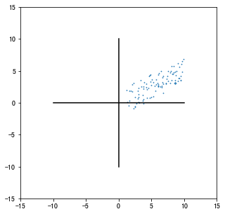
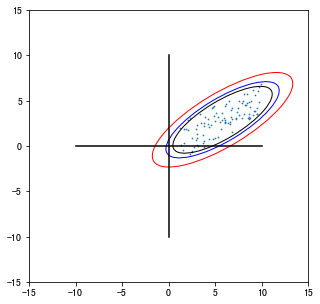

.. currentmodule:: transbigdata

******************************
Activity
******************************

.. autosummary::

    plot_activity
    entropy
    entropy_rate
    ellipse_params
    ellipse_plot

Activity plot
----------------------------------------------------

.. autofunction:: plot_activity

Entropy
----------------------------------------------------

.. autofunction:: entropy
    
.. autofunction:: entropy_rate

Confidence ellipse
----------------------------------------------------

.. autofunction:: ellipse_params

.. autofunction:: ellipse_plot

用法
================================================

::

    import pandas as pd
    import transbigdata as tbd
    import numpy as np
    #生成测试用数据
    data = np.random.uniform(1,10,(100,2))
    data[:,1:] = 0.5*data[:,0:1]+np.random.uniform(-2,2,(100,1))
    data = pd.DataFrame(data,columns = ['x','y'])
    
    #绘制数据分布
    import matplotlib.pyplot as plt
    plt.figure(1,(5,5))
    #绘制数据点
    plt.scatter(data['x'],data['y'],s = 0.5)
    #绘制坐标轴
    plt.plot([-10,10],[0,0],c = 'k')
    plt.plot([0,0],[-10,10],c = 'k')
    plt.xlim(-15,15)
    plt.ylim(-15,15)
    plt.show()

输入数据与xy坐标所在列名，置信度，估计椭圆参数
分别代表[中心点坐标，短轴，长轴，角度，面积，扁率

::

    
    ellip_params = tbd.ellipse_params(data,confidence=95,col = ['x','y'])
    ellip_params

.. parsed-literal::

    [array([5.78928146, 2.88466235]),
     4.6981983145616875,
     14.04315715927693,
     -58.15524535916836,
     51.8186366184246,
     0.6654457212665993]

再用tbd.ellipse_plot绘制置信椭圆

::

    #绘制数据分布
    import matplotlib.pyplot as plt
    plt.figure(1,(5,5))
    ax = plt.subplot(111)
    #绘制数据点
    plt.scatter(data['x'],data['y'],s = 0.5)
    #获取置信椭圆参数并绘制椭圆
    #99%置信椭圆
    ellip_params = tbd.ellipse_params(data,confidence=99,col = ['x','y'])
    tbd.ellipse_plot(ellip_params,ax,fill = False,edgecolor = 'r',linewidth = 1)
    #95%置信椭圆
    ellip_params = tbd.ellipse_params(data,confidence=95,col = ['x','y'])
    tbd.ellipse_plot(ellip_params,ax,fill = False,edgecolor = 'b',linewidth = 1)
    #90%置信椭圆
    ellip_params = tbd.ellipse_params(data,confidence=90,col = ['x','y'])
    tbd.ellipse_plot(ellip_params,ax,fill = False,edgecolor = 'k',linewidth = 1)
    #绘制坐标轴
    plt.plot([-10,10],[0,0],c = 'k')
    plt.plot([0,0],[-10,10],c = 'k')
    plt.xlim(-15,15)
    plt.ylim(-15,15)
    plt.show()

