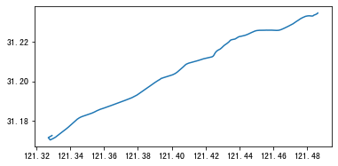
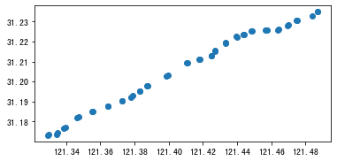
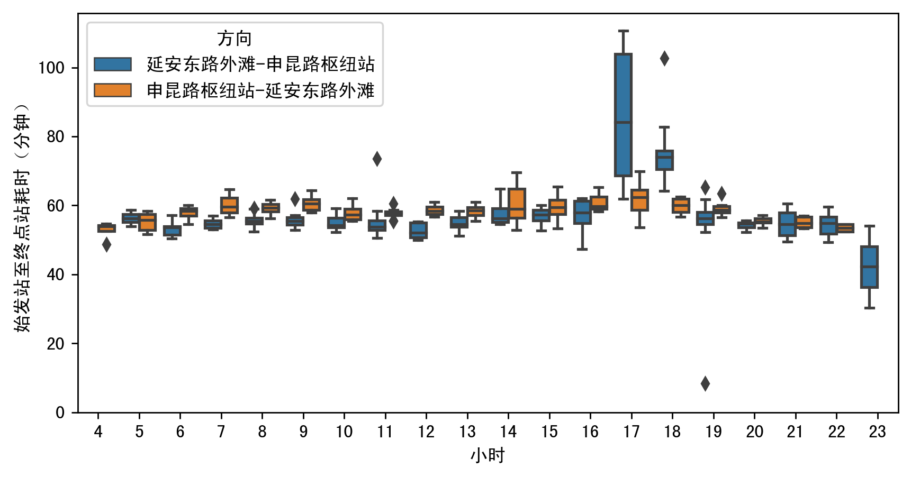
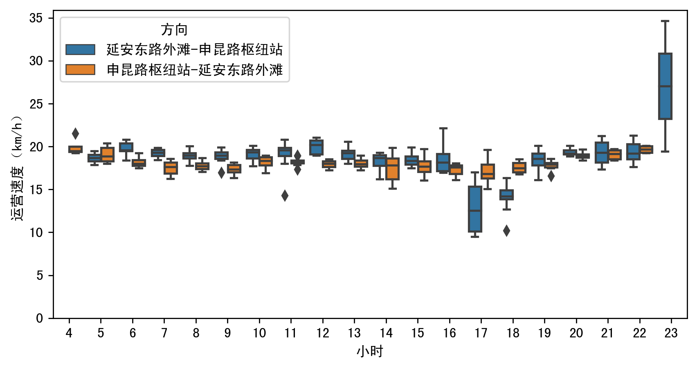

公交GPS的到离站信息匹配
=======================

| 这个案例的Jupyter notebook: `点击这里 <https://github.com/ni1o1/transbigdata/blob/main/example/Example%202-Identifying%20arrival%20and%20departure%20information%20from%20Bus%20GPS%20data.ipynb>`__.
| 可以点击 `这个链接 <https://mybinder.org/v2/gh/ni1o1/transbigdata/9507de936806c34a4befd74aa9227b012569a6aa?urlpath=lab%2Ftree%2Fexample%2FExample%202-Identifying%20arrival%20and%20departure%20information%20from%20Bus%20GPS%20data.ipynb>`__ 在线编辑器中尝试
下面的案例展示如何用TransBigData包处理公交GPS数据，以内置方法计算公交车辆的到离站信息、统计公交单程耗时与运营车速

::

    import transbigdata as tbd
    import pandas as pd
    import geopandas as gpd

读取数据
--------

读取GPS数据

::

    BUS_GPS= pd.read_csv(r'busgps.csv',header = None)
    BUS_GPS.columns = ['GPSDateTime', 'LineId', 'LineName', 'NextLevel', 'PrevLevel',
           'Strlatlon', 'ToDir', 'VehicleId', 'VehicleNo', 'unknow']
    #时间转换为datetime格式
    BUS_GPS['GPSDateTime'] = pd.to_datetime(BUS_GPS['GPSDateTime'])

经纬度坐标转换

::

    #切分经纬度的字符串
    BUS_GPS['lon'] = BUS_GPS['Strlatlon'].apply(lambda r:r.split(',')[0])
    BUS_GPS['lat'] = BUS_GPS['Strlatlon'].apply(lambda r:r.split(',')[1])
    #坐标系转换
    BUS_GPS['lon'],BUS_GPS['lat'] = tbd.gcj02towgs84(BUS_GPS['lon'].astype(float),BUS_GPS['lat'].astype(float))
    BUS_GPS.head(5)

.. raw:: html

    

    
    <table border="1" class="dataframe">
      <thead>
        <tr style="text-align: right;">
          <th></th>
          <th>GPSDateTime</th>
          <th>LineId</th>
          <th>LineName</th>
          <th>NextLevel</th>
          <th>PrevLevel</th>
          <th>Strlatlon</th>
          <th>ToDir</th>
          <th>VehicleId</th>
          <th>VehicleNo</th>
          <th>unknow</th>
          <th>lon</th>
          <th>lat</th>
        </tr>
      </thead>
      <tbody>
        <tr>
          <th>0</th>
          <td>2019-01-16 23:59:59</td>
          <td>7100</td>
          <td>71</td>
          <td>2</td>
          <td>1</td>
          <td>121.335413,31.173188</td>
          <td>1</td>
          <td>沪D-R7103</td>
          <td>Z5A-0021</td>
          <td>1</td>
          <td>121.330858</td>
          <td>31.175129</td>
        </tr>
        <tr>
          <th>1</th>
          <td>2019-01-17 00:00:00</td>
          <td>7100</td>
          <td>71</td>
          <td>2</td>
          <td>1</td>
          <td>121.334616,31.172271</td>
          <td>1</td>
          <td>沪D-R1273</td>
          <td>Z5A-0002</td>
          <td>1</td>
          <td>121.330063</td>
          <td>31.174214</td>
        </tr>
        <tr>
          <th>2</th>
          <td>2019-01-17 00:00:00</td>
          <td>7100</td>
          <td>71</td>
          <td>24</td>
          <td>23</td>
          <td>121.339955,31.173025</td>
          <td>0</td>
          <td>沪D-R5257</td>
          <td>Z5A-0020</td>
          <td>1</td>
          <td>121.335390</td>
          <td>31.174958</td>
        </tr>
        <tr>
          <th>3</th>
          <td>2019-01-17 00:00:01</td>
          <td>7100</td>
          <td>71</td>
          <td>14</td>
          <td>13</td>
          <td>121.409491,31.20433</td>
          <td>0</td>
          <td>沪D-R5192</td>
          <td>Z5A-0013</td>
          <td>1</td>
          <td>121.404843</td>
          <td>31.206179</td>
        </tr>
        <tr>
          <th>4</th>
          <td>2019-01-17 00:00:03</td>
          <td>7100</td>
          <td>71</td>
          <td>15</td>
          <td>14</td>
          <td>121.398615,31.200253</td>
          <td>0</td>
          <td>沪D-T0951</td>
          <td>Z5A-0022</td>
          <td>1</td>
          <td>121.393966</td>
          <td>31.202103</td>
        </tr>
      </tbody>
    </table>
    

读取公交线数据

::

    shp = r'busline.json'
    linegdf = gpd.GeoDataFrame.from_file(shp,encoding = 'gbk')
    line = linegdf.iloc[:1].copy()
    line.plot()

读取公交站点数据

::

    shp = r'busstop.json'
    stop = gpd.GeoDataFrame.from_file(shp,encoding = 'gbk')
    stop = stop[stop['linename'] == '71路(延安东路外滩-申昆路枢纽站)']
    stop.plot()

到离站信息匹配
--------------

::

    arriveinfo = tbd.busgps_arriveinfo(BUS_GPS,line,stop)

数据清洗中...

运行位置匹配中......

匹配到离站信息.........................................................................................................................................................

::

    arriveinfo

.. raw:: html

    

    
    <table border="1" class="dataframe">
      <thead>
        <tr style="text-align: right;">
          <th></th>
          <th>arrivetime</th>
          <th>leavetime</th>
          <th>stopname</th>
          <th>VehicleId</th>
        </tr>
      </thead>
      <tbody>
        <tr>
          <th>0</th>
          <td>2019-01-17 07:19:42</td>
          <td>2019-01-17 07:31:14</td>
          <td>延安东路外滩</td>
          <td>1</td>
        </tr>
        <tr>
          <th>1</th>
          <td>2019-01-17 09:53:08</td>
          <td>2019-01-17 10:09:34</td>
          <td>延安东路外滩</td>
          <td>1</td>
        </tr>
        <tr>
          <th>0</th>
          <td>2019-01-17 07:13:23</td>
          <td>2019-01-17 07:15:45</td>
          <td>西藏中路</td>
          <td>1</td>
        </tr>
        <tr>
          <th>1</th>
          <td>2019-01-17 07:34:24</td>
          <td>2019-01-17 07:35:38</td>
          <td>西藏中路</td>
          <td>1</td>
        </tr>
        <tr>
          <th>2</th>
          <td>2019-01-17 09:47:03</td>
          <td>2019-01-17 09:50:22</td>
          <td>西藏中路</td>
          <td>1</td>
        </tr>
        <tr>
          <th>...</th>
          <td>...</td>
          <td>...</td>
          <td>...</td>
          <td>...</td>
        </tr>
        <tr>
          <th>2</th>
          <td>2019-01-17 16:35:52</td>
          <td>2019-01-17 16:36:49</td>
          <td>吴宝路</td>
          <td>148</td>
        </tr>
        <tr>
          <th>3</th>
          <td>2019-01-17 19:21:09</td>
          <td>2019-01-17 19:23:44</td>
          <td>吴宝路</td>
          <td>148</td>
        </tr>
        <tr>
          <th>0</th>
          <td>2019-01-17 13:36:26</td>
          <td>2019-01-17 13:45:04</td>
          <td>申昆路枢纽站</td>
          <td>148</td>
        </tr>
        <tr>
          <th>1</th>
          <td>2019-01-17 15:52:26</td>
          <td>2019-01-17 16:32:46</td>
          <td>申昆路枢纽站</td>
          <td>148</td>
        </tr>
        <tr>
          <th>2</th>
          <td>2019-01-17 19:24:54</td>
          <td>2019-01-17 19:25:55</td>
          <td>申昆路枢纽站</td>
          <td>148</td>
        </tr>
      </tbody>
    </table>
    
8984 rows × 4 columns

    

单程耗时
--------

::

    onewaytime = tbd.busgps_onewaytime(arriveinfo,
                                       start = '延安东路外滩',
                                       end = '申昆路枢纽站',col = ['VehicleId','stopname'])

::

    ## 绘制耗时分布箱型图
    import numpy as np
    import matplotlib.pyplot as plt
    import seaborn as sns
    plt.rcParams['font.sans-serif']=['SimHei']
    plt.rcParams['font.serif'] = ['SimHei']
    plt.rcParams['axes.unicode_minus']=False
    fig     = plt.figure(1,(8,4),dpi = 250)    
    ax1      = plt.subplot(111)
    
    sns.boxplot(x = 'shour',y = onewaytime['duration']/60,hue = '方向',data = onewaytime)
    
    plt.ylabel('始发站至终点站耗时（分钟）')
    plt.xlabel('小时')
    plt.ylim(0)
    plt.show()

运营车速
--------

::

    #转换坐标系为投影坐标系，方便后面计算距离
    line.crs = {'init':'epsg:4326'}
    line_2416 = line.to_crs(epsg = 2416)
    #公交线路数据里面的geometry
    lineshp = line_2416['geometry'].iloc[0]
    linename = line_2416['name'].iloc[0]
    lineshp

.. parsed-literal::

    /opt/anaconda3/lib/python3.8/site-packages/pyproj/crs/crs.py:53: FutureWarning: '+init=<authority>:<code>' syntax is deprecated. '<authority>:<code>' is the preferred initialization method. When making the change, be mindful of axis order changes: https://pyproj4.github.io/pyproj/stable/gotchas.html#axis-order-changes-in-proj-6
      return _prepare_from_string(" ".join(pjargs))

.. image:: output_18_1.png

::

    #筛选去掉车速过快的
    #车速单位转换为km/h
    onewaytime['speed'] = (lineshp.length/onewaytime['duration'])*3.6
    onewaytime = onewaytime[onewaytime['speed']<=60]

::

    ## 车速分布
    import numpy as np
    import matplotlib.pyplot as plt
    import seaborn as sns
    plt.rcParams['font.sans-serif']=['SimHei']
    plt.rcParams['font.serif'] = ['SimHei']
    plt.rcParams['axes.unicode_minus']=False
    fig     = plt.figure(1,(8,4),dpi = 250)    
    ax1      = plt.subplot(111)
    sns.boxplot(x = 'shour',y = 'speed',hue = '方向',data = onewaytime)
    plt.ylabel('运营速度（km/h）')
    plt.xlabel('小时')
    plt.ylim(0)
    plt.show()

