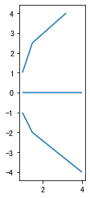

点与点、点与线匹配实例
======================

导入transbigdata包

.. code:: ipython3

    import transbigdata as tbd

生成两个GeoDataFrame表，但它们只有经纬度列

.. code:: ipython3

    import pandas as pd
    import geopandas as gpd
    from shapely.geometry import LineString
    dfA = gpd.GeoDataFrame([[1,2],[2,4],[2,6],
                            [2,10],[24,6],[21,6],
                            [22,6]],columns = ['lon1','lat1'])
    dfB = gpd.GeoDataFrame([[1,3],[2,5],[2,2]],columns = ['lon','lat'])

点与点匹配（DataFrame与DataFrame）
----------------------------------

使用tbd.ckdnearest进行点与点匹配，如果是DataFrame与DataFrame匹配（不含有地理信息），则需要指定前后两个表的经纬度列

.. code:: ipython3

    tbd.ckdnearest(dfA,dfB,Aname=['lon1','lat1'],Bname=['lon','lat'])
    #此时计算出的距离为经纬度换算实际距离

.. raw:: html

    

    
    <table border="1" class="dataframe">
      <thead>
        <tr style="text-align: right;">
          <th></th>
          <th>lon1</th>
          <th>lat1</th>
          <th>index</th>
          <th>lon</th>
          <th>lat</th>
          <th>dist</th>
        </tr>
      </thead>
      <tbody>
        <tr>
          <th>0</th>
          <td>1</td>
          <td>2</td>
          <td>0</td>
          <td>1</td>
          <td>3</td>
          <td>1.111949e+05</td>
        </tr>
        <tr>
          <th>1</th>
          <td>2</td>
          <td>4</td>
          <td>1</td>
          <td>2</td>
          <td>5</td>
          <td>1.111949e+05</td>
        </tr>
        <tr>
          <th>2</th>
          <td>2</td>
          <td>6</td>
          <td>1</td>
          <td>2</td>
          <td>5</td>
          <td>1.111949e+05</td>
        </tr>
        <tr>
          <th>3</th>
          <td>2</td>
          <td>10</td>
          <td>1</td>
          <td>2</td>
          <td>5</td>
          <td>5.559746e+05</td>
        </tr>
        <tr>
          <th>4</th>
          <td>24</td>
          <td>6</td>
          <td>1</td>
          <td>2</td>
          <td>5</td>
          <td>2.437393e+06</td>
        </tr>
        <tr>
          <th>5</th>
          <td>21</td>
          <td>6</td>
          <td>1</td>
          <td>2</td>
          <td>5</td>
          <td>2.105798e+06</td>
        </tr>
        <tr>
          <th>6</th>
          <td>22</td>
          <td>6</td>
          <td>1</td>
          <td>2</td>
          <td>5</td>
          <td>2.216318e+06</td>
        </tr>
      </tbody>
    </table>
    

点与点匹配（GeoDataFrame与GeoDataFrame）
----------------------------------------

将A表B表变为含有点信息的GeoDataFrame

.. code:: ipython3

    dfA['geometry'] = gpd.points_from_xy(dfA['lon1'],dfA['lat1'])
    dfB['geometry'] = gpd.points_from_xy(dfB['lon'],dfB['lat'])

使用tbd.ckdnearest_point进行点与点匹配

.. code:: ipython3

    tbd.ckdnearest_point(dfA,dfB)
    #此时计算出的距离为经纬度距离

.. raw:: html

    

    
    <table border="1" class="dataframe">
      <thead>
        <tr style="text-align: right;">
          <th></th>
          <th>lon1</th>
          <th>lat1</th>
          <th>geometry_x</th>
          <th>dist</th>
          <th>index</th>
          <th>lon</th>
          <th>lat</th>
          <th>geometry_y</th>
        </tr>
      </thead>
      <tbody>
        <tr>
          <th>0</th>
          <td>1</td>
          <td>2</td>
          <td>POINT (1.00000 2.00000)</td>
          <td>1.000000</td>
          <td>0</td>
          <td>1</td>
          <td>3</td>
          <td>POINT (1.00000 3.00000)</td>
        </tr>
        <tr>
          <th>1</th>
          <td>2</td>
          <td>4</td>
          <td>POINT (2.00000 4.00000)</td>
          <td>1.000000</td>
          <td>1</td>
          <td>2</td>
          <td>5</td>
          <td>POINT (2.00000 5.00000)</td>
        </tr>
        <tr>
          <th>2</th>
          <td>2</td>
          <td>6</td>
          <td>POINT (2.00000 6.00000)</td>
          <td>1.000000</td>
          <td>1</td>
          <td>2</td>
          <td>5</td>
          <td>POINT (2.00000 5.00000)</td>
        </tr>
        <tr>
          <th>3</th>
          <td>2</td>
          <td>10</td>
          <td>POINT (2.00000 10.00000)</td>
          <td>5.000000</td>
          <td>1</td>
          <td>2</td>
          <td>5</td>
          <td>POINT (2.00000 5.00000)</td>
        </tr>
        <tr>
          <th>4</th>
          <td>24</td>
          <td>6</td>
          <td>POINT (24.00000 6.00000)</td>
          <td>22.022716</td>
          <td>1</td>
          <td>2</td>
          <td>5</td>
          <td>POINT (2.00000 5.00000)</td>
        </tr>
        <tr>
          <th>5</th>
          <td>21</td>
          <td>6</td>
          <td>POINT (21.00000 6.00000)</td>
          <td>19.026298</td>
          <td>1</td>
          <td>2</td>
          <td>5</td>
          <td>POINT (2.00000 5.00000)</td>
        </tr>
        <tr>
          <th>6</th>
          <td>22</td>
          <td>6</td>
          <td>POINT (22.00000 6.00000)</td>
          <td>20.024984</td>
          <td>1</td>
          <td>2</td>
          <td>5</td>
          <td>POINT (2.00000 5.00000)</td>
        </tr>
      </tbody>
    </table>
    

点与线匹配（GeoDataFrame与GeoDataFrame）
----------------------------------------

将A表变为地理点，B表为线

.. code:: ipython3

    dfA['geometry'] = gpd.points_from_xy(dfA['lon1'],dfA['lat1'])
    dfB['geometry'] = [LineString([[1,1],[1.5,2.5],[3.2,4]]),
                      LineString([[1,0],[1.5,0],[4,0]]),
                       LineString([[1,-1],[1.5,-2],[4,-4]])]
    dfB.plot()

.. parsed-literal::

    <AxesSubplot:>

用tbd.ckdnearest_line可以实现点匹配线，其原理是将线中的折点提取，然后使用点匹配点。

.. code:: ipython3

    tbd.ckdnearest_line(dfA,dfB)
    #此时计算出的距离为经纬度距离

.. raw:: html

    

    
    <table border="1" class="dataframe">
      <thead>
        <tr style="text-align: right;">
          <th></th>
          <th>lon1</th>
          <th>lat1</th>
          <th>geometry_x</th>
          <th>dist</th>
          <th>index</th>
          <th>lon</th>
          <th>lat</th>
          <th>geometry_y</th>
        </tr>
      </thead>
      <tbody>
        <tr>
          <th>0</th>
          <td>1</td>
          <td>2</td>
          <td>POINT (1.00000 2.00000)</td>
          <td>0.707107</td>
          <td>0</td>
          <td>1</td>
          <td>3</td>
          <td>LINESTRING (1.00000 1.00000, 1.50000 2.50000, ...</td>
        </tr>
        <tr>
          <th>1</th>
          <td>2</td>
          <td>4</td>
          <td>POINT (2.00000 4.00000)</td>
          <td>1.200000</td>
          <td>0</td>
          <td>1</td>
          <td>3</td>
          <td>LINESTRING (1.00000 1.00000, 1.50000 2.50000, ...</td>
        </tr>
        <tr>
          <th>2</th>
          <td>2</td>
          <td>6</td>
          <td>POINT (2.00000 6.00000)</td>
          <td>2.332381</td>
          <td>0</td>
          <td>1</td>
          <td>3</td>
          <td>LINESTRING (1.00000 1.00000, 1.50000 2.50000, ...</td>
        </tr>
        <tr>
          <th>3</th>
          <td>2</td>
          <td>10</td>
          <td>POINT (2.00000 10.00000)</td>
          <td>6.118823</td>
          <td>0</td>
          <td>1</td>
          <td>3</td>
          <td>LINESTRING (1.00000 1.00000, 1.50000 2.50000, ...</td>
        </tr>
        <tr>
          <th>4</th>
          <td>21</td>
          <td>6</td>
          <td>POINT (21.00000 6.00000)</td>
          <td>17.912007</td>
          <td>0</td>
          <td>1</td>
          <td>3</td>
          <td>LINESTRING (1.00000 1.00000, 1.50000 2.50000, ...</td>
        </tr>
        <tr>
          <th>5</th>
          <td>22</td>
          <td>6</td>
          <td>POINT (22.00000 6.00000)</td>
          <td>18.906084</td>
          <td>0</td>
          <td>1</td>
          <td>3</td>
          <td>LINESTRING (1.00000 1.00000, 1.50000 2.50000, ...</td>
        </tr>
        <tr>
          <th>6</th>
          <td>24</td>
          <td>6</td>
          <td>POINT (24.00000 6.00000)</td>
          <td>20.880613</td>
          <td>1</td>
          <td>2</td>
          <td>5</td>
          <td>LINESTRING (1.00000 0.00000, 1.50000 0.00000, ...</td>
        </tr>
      </tbody>
    </table>
    

