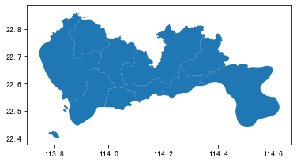
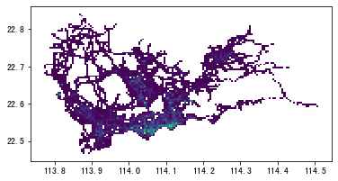
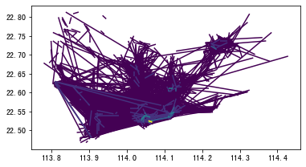
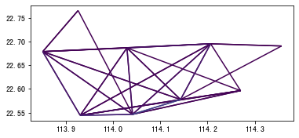
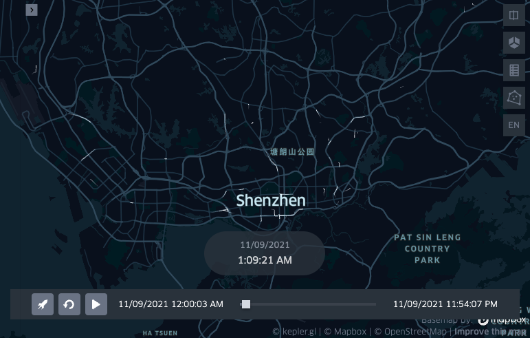

出租车数据处理
==============

| 这个案例的Jupyter notebook: `点击这里 <https://github.com/ni1o1/transbigdata/blob/main/example/Example%201-Taxi%20GPS%20data%20processing.ipynb>`__.
| 可以点击 `这个链接 <https://mybinder.org/v2/gh/ni1o1/transbigdata/d7d6fa33ff16440ba1698b10dd3cf3f76ff00abd?urlpath=lab%2Ftree%2Fexample%2FExample%201-Taxi%20GPS%20data%20processing.ipynb>`__ 在线编辑器中尝试
| 使用示例中的样例数据集在github仓库中，链接为：https://github.com/ni1o1/transbigdata/tree/main/example
| 下面我们介绍如何使用TransBigData包，调用其中的函数实现对出租车GPS数据的快速处理。
| 首先我们引入TransBigData包，并读取数据:

::

    import transbigdata as tbd
    import pandas as pd
    import geopandas as gpd
    #读取数据    
    data = pd.read_csv('TaxiData-Sample.csv',header = None) 
    data.columns = ['VehicleNum','Time','Lng','Lat','OpenStatus','Speed']    
    data

.. raw:: html

    

    
    <table border="1" class="dataframe">
      <thead>
        <tr style="text-align: right;">
          <th></th>
          <th>VehicleNum</th>
          <th>Time</th>
          <th>Lng</th>
          <th>Lat</th>
          <th>OpenStatus</th>
          <th>Speed</th>
        </tr>
      </thead>
      <tbody>
        <tr>
          <th>0</th>
          <td>34745</td>
          <td>20:27:43</td>
          <td>113.806847</td>
          <td>22.623249</td>
          <td>1</td>
          <td>27</td>
        </tr>
        <tr>
          <th>1</th>
          <td>34745</td>
          <td>20:24:07</td>
          <td>113.809898</td>
          <td>22.627399</td>
          <td>0</td>
          <td>0</td>
        </tr>
        <tr>
          <th>2</th>
          <td>34745</td>
          <td>20:24:27</td>
          <td>113.809898</td>
          <td>22.627399</td>
          <td>0</td>
          <td>0</td>
        </tr>
        <tr>
          <th>3</th>
          <td>34745</td>
          <td>20:22:07</td>
          <td>113.811348</td>
          <td>22.628067</td>
          <td>0</td>
          <td>0</td>
        </tr>
        <tr>
          <th>4</th>
          <td>34745</td>
          <td>20:10:06</td>
          <td>113.819885</td>
          <td>22.647800</td>
          <td>0</td>
          <td>54</td>
        </tr>
        <tr>
          <th>...</th>
          <td>...</td>
          <td>...</td>
          <td>...</td>
          <td>...</td>
          <td>...</td>
          <td>...</td>
        </tr>
        <tr>
          <th>544994</th>
          <td>28265</td>
          <td>21:35:13</td>
          <td>114.321503</td>
          <td>22.709499</td>
          <td>0</td>
          <td>18</td>
        </tr>
        <tr>
          <th>544995</th>
          <td>28265</td>
          <td>09:08:02</td>
          <td>114.322701</td>
          <td>22.681700</td>
          <td>0</td>
          <td>0</td>
        </tr>
        <tr>
          <th>544996</th>
          <td>28265</td>
          <td>09:14:31</td>
          <td>114.336700</td>
          <td>22.690100</td>
          <td>0</td>
          <td>0</td>
        </tr>
        <tr>
          <th>544997</th>
          <td>28265</td>
          <td>21:19:12</td>
          <td>114.352600</td>
          <td>22.728399</td>
          <td>0</td>
          <td>0</td>
        </tr>
        <tr>
          <th>544998</th>
          <td>28265</td>
          <td>19:08:06</td>
          <td>114.137703</td>
          <td>22.621700</td>
          <td>0</td>
          <td>0</td>
        </tr>
      </tbody>
    </table>
    
544999 rows × 6 columns

    

::

    #读取区域信息
    import geopandas as gpd
    sz = gpd.read_file(r'sz/sz.shp')
    sz.crs = None
    sz.plot()

数据预处理
----------------

TransBigData包也集成了数据预处理的常用方法。其中，tbd.clean_outofshape方法输入数据和研究范围区域信息，筛选剔除研究范围外的数据。而tbd.clean_taxi_status方法则可以剔除的载客状态瞬间变化的记录。在使用预处理的方法时，需要传入相应的列，代码如下：

::

    #数据预处理
    #剔除研究范围外的数据
    data = tbd.clean_outofshape(data, sz, col=['Lng', 'Lat'], accuracy=500)
    #剔除出租车数据中载客状态瞬间变化的记录
    data = tbd.clean_taxi_status(data, col=['VehicleNum', 'Time', 'OpenStatus'])

数据栅格化
----------------------------

以栅格形式表达数据分布是最基本的表达方法。GPS数据经过栅格化后，每个数据点都含有对应的栅格信息，采用栅格表达数据的分布时，其表示的分布情况与真实情况接近。如果要使用TransBigData工具进行栅格划分，首先需要确定栅格化的参数（可以理解为定义了一个栅格坐标系），参数可以帮助我们快速进行栅格化:

::

    #栅格化
    #定义范围，获取栅格化参数
    bounds = [113.6,22.4,114.8,22.9]
    params = tbd.grid_params(bounds,accuracy = 500)
    params

(113.6, 22.4, 0.004872390756896538, 0.004496605206422906)

取得栅格化参数后，将GPS对应至栅格，由LONCOL与LATCOL两列共同指定一个栅格:

::

    #将GPS栅格化
    data['LONCOL'],data['LATCOL'] = tbd.GPS_to_grids(data['Lng'],data['Lat'],params)

统计每个栅格的数据量:

::

    #集计栅格数据量
    datatest = data.groupby(['LONCOL','LATCOL'])['VehicleNum'].count().reset_index()

生成栅格的地理图形，并将它转化为GeoDataFrame:

::

    #生成栅格地理图形
    datatest['geometry'] = tbd.gridid_to_polygon(datatest['LONCOL'],datatest['LATCOL'],params)
    #转为GeoDataFrame
    import geopandas as gpd
    datatest = gpd.GeoDataFrame(datatest)

绘制栅格测试是否成功:

::

    #绘制
    datatest.plot(column = 'VehicleNum')

出行OD提取与集计
----------------------

使用tbd.taxigps_to_od方法，传入对应的列名，即可提取出行OD:

::

    #从GPS数据提取OD
    oddata = tbd.taxigps_to_od(data,col = ['VehicleNum','Time','Lng','Lat','OpenStatus'])
    oddata

.. raw:: html

    

    
    <table border="1" class="dataframe">
      <thead>
        <tr style="text-align: right;">
          <th></th>
          <th>VehicleNum</th>
          <th>stime</th>
          <th>slon</th>
          <th>slat</th>
          <th>etime</th>
          <th>elon</th>
          <th>elat</th>
          <th>ID</th>
        </tr>
      </thead>
      <tbody>
        <tr>
          <th>427075</th>
          <td>22396</td>
          <td>00:19:41</td>
          <td>114.013016</td>
          <td>22.664818</td>
          <td>00:23:01</td>
          <td>114.021400</td>
          <td>22.663918</td>
          <td>0</td>
        </tr>
        <tr>
          <th>131301</th>
          <td>22396</td>
          <td>00:41:51</td>
          <td>114.021767</td>
          <td>22.640200</td>
          <td>00:43:44</td>
          <td>114.026070</td>
          <td>22.640266</td>
          <td>1</td>
        </tr>
        <tr>
          <th>417417</th>
          <td>22396</td>
          <td>00:45:44</td>
          <td>114.028099</td>
          <td>22.645082</td>
          <td>00:47:44</td>
          <td>114.030380</td>
          <td>22.650017</td>
          <td>2</td>
        </tr>
        <tr>
          <th>376160</th>
          <td>22396</td>
          <td>01:08:26</td>
          <td>114.034897</td>
          <td>22.616301</td>
          <td>01:16:34</td>
          <td>114.035614</td>
          <td>22.646717</td>
          <td>3</td>
        </tr>
        <tr>
          <th>21768</th>
          <td>22396</td>
          <td>01:26:06</td>
          <td>114.046021</td>
          <td>22.641251</td>
          <td>01:34:48</td>
          <td>114.066048</td>
          <td>22.636183</td>
          <td>4</td>
        </tr>
        <tr>
          <th>...</th>
          <td>...</td>
          <td>...</td>
          <td>...</td>
          <td>...</td>
          <td>...</td>
          <td>...</td>
          <td>...</td>
          <td>...</td>
        </tr>
        <tr>
          <th>57666</th>
          <td>36805</td>
          <td>22:37:42</td>
          <td>114.113403</td>
          <td>22.534767</td>
          <td>22:48:01</td>
          <td>114.114365</td>
          <td>22.550632</td>
          <td>5332</td>
        </tr>
        <tr>
          <th>175519</th>
          <td>36805</td>
          <td>22:49:12</td>
          <td>114.114365</td>
          <td>22.550632</td>
          <td>22:50:40</td>
          <td>114.115501</td>
          <td>22.557983</td>
          <td>5333</td>
        </tr>
        <tr>
          <th>212092</th>
          <td>36805</td>
          <td>22:52:07</td>
          <td>114.115402</td>
          <td>22.558083</td>
          <td>23:03:27</td>
          <td>114.118484</td>
          <td>22.547867</td>
          <td>5334</td>
        </tr>
        <tr>
          <th>119041</th>
          <td>36805</td>
          <td>23:03:45</td>
          <td>114.118484</td>
          <td>22.547867</td>
          <td>23:20:09</td>
          <td>114.133286</td>
          <td>22.617750</td>
          <td>5335</td>
        </tr>
        <tr>
          <th>224103</th>
          <td>36805</td>
          <td>23:36:19</td>
          <td>114.112968</td>
          <td>22.549601</td>
          <td>23:43:12</td>
          <td>114.089485</td>
          <td>22.538918</td>
          <td>5336</td>
        </tr>
      </tbody>
    </table>
    
5337 rows × 8 columns

    

对提取出的OD进行OD的栅格集计,并生成GeoDataFrame

::

    #栅格化OD并集计
    od_gdf = tbd.odagg_grid(oddata,params)
    od_gdf.plot(column = 'count')

出行OD小区集计
--------------------------------

TransBigData包也提供了将OD直接集计到小区的方法

::

    #OD集计到小区（在不传入栅格化参数时，直接用经纬度匹配）
    od_gdf = tbd.odagg_shape(oddata,sz,round_accuracy=6)
    od_gdf.plot(column = 'count')

::

    #OD集计到小区（传入栅格化参数时，先栅格化后匹配，可加快匹配速度，数据量大时建议使用）
    od_gdf = tbd.odagg_shape(oddata,sz,params = params)
    od_gdf.plot(column = 'count')

基于matplotlib的地图绘制
------------------------------

tbd中提供了地图底图加载和比例尺指北针的功能。使用这个方法之前首先需要设置mapboxtoken和底图存放位置，详情看：\ `这个链接 <https://transbigdata.readthedocs.io/zh_CN/latest/plot_map.html>`__\ 。plot_map方法添加地图底图，plotscale添加比例尺和指北针:

::

    #创建图框
    import matplotlib.pyplot as plt
    import plot_map
    fig =plt.figure(1,(8,8),dpi=80)
    ax =plt.subplot(111)
    plt.sca(ax)
    #添加地图底图
    tbd.plot_map(plt,bounds,zoom = 12,style = 4)
    #绘制colorbar
    cax = plt.axes([0.05, 0.33, 0.02, 0.3])
    plt.title('count')
    plt.sca(ax)
    #绘制OD
    od_gdf.plot(ax = ax,vmax = 100,column = 'count',cax = cax,legend = True)
    #绘制小区底图
    sz.plot(ax = ax,edgecolor = (0,0,0,1),facecolor = (0,0,0,0.2),linewidths=0.5)
    #添加比例尺和指北针
    tbd.plotscale(ax,bounds = bounds,textsize = 10,compasssize = 1,accuracy = 2000,rect = [0.06,0.03],zorder = 10)
    plt.axis('off')
    plt.xlim(bounds[0],bounds[2])
    plt.ylim(bounds[1],bounds[3])
    plt.show()

.. image:: output_29_0.png

出租车轨迹的提取
----------------

使用tbd.taxigps_traj_point方法，输入数据和OD数据，可以提取出轨迹点

::

    data_deliver,data_idle = tbd.taxigps_traj_point(data,oddata,col=['VehicleNum', 'Time', 'Lng', 'Lat', 'OpenStatus'])

::

    data_deliver

.. raw:: html

    

    
    <table border="1" class="dataframe">
      <thead>
        <tr style="text-align: right;">
          <th></th>
          <th>VehicleNum</th>
          <th>Time</th>
          <th>Lng</th>
          <th>Lat</th>
          <th>OpenStatus</th>
          <th>Speed</th>
          <th>LONCOL</th>
          <th>LATCOL</th>
          <th>ID</th>
          <th>flag</th>
        </tr>
      </thead>
      <tbody>
        <tr>
          <th>427075</th>
          <td>22396</td>
          <td>00:19:41</td>
          <td>114.013016</td>
          <td>22.664818</td>
          <td>1</td>
          <td>63.0</td>
          <td>85.0</td>
          <td>59.0</td>
          <td>0.0</td>
          <td>1.0</td>
        </tr>
        <tr>
          <th>427085</th>
          <td>22396</td>
          <td>00:19:49</td>
          <td>114.014030</td>
          <td>22.665483</td>
          <td>1</td>
          <td>55.0</td>
          <td>85.0</td>
          <td>59.0</td>
          <td>0.0</td>
          <td>1.0</td>
        </tr>
        <tr>
          <th>416622</th>
          <td>22396</td>
          <td>00:21:01</td>
          <td>114.018898</td>
          <td>22.662500</td>
          <td>1</td>
          <td>1.0</td>
          <td>86.0</td>
          <td>58.0</td>
          <td>0.0</td>
          <td>1.0</td>
        </tr>
        <tr>
          <th>427480</th>
          <td>22396</td>
          <td>00:21:41</td>
          <td>114.019348</td>
          <td>22.662300</td>
          <td>1</td>
          <td>7.0</td>
          <td>86.0</td>
          <td>58.0</td>
          <td>0.0</td>
          <td>1.0</td>
        </tr>
        <tr>
          <th>416623</th>
          <td>22396</td>
          <td>00:22:21</td>
          <td>114.020615</td>
          <td>22.663366</td>
          <td>1</td>
          <td>0.0</td>
          <td>86.0</td>
          <td>59.0</td>
          <td>0.0</td>
          <td>1.0</td>
        </tr>
        <tr>
          <th>...</th>
          <td>...</td>
          <td>...</td>
          <td>...</td>
          <td>...</td>
          <td>...</td>
          <td>...</td>
          <td>...</td>
          <td>...</td>
          <td>...</td>
          <td>...</td>
        </tr>
        <tr>
          <th>170960</th>
          <td>36805</td>
          <td>23:42:31</td>
          <td>114.092766</td>
          <td>22.538317</td>
          <td>1</td>
          <td>66.0</td>
          <td>101.0</td>
          <td>31.0</td>
          <td>5336.0</td>
          <td>1.0</td>
        </tr>
        <tr>
          <th>170958</th>
          <td>36805</td>
          <td>23:42:37</td>
          <td>114.091721</td>
          <td>22.538349</td>
          <td>1</td>
          <td>65.0</td>
          <td>101.0</td>
          <td>31.0</td>
          <td>5336.0</td>
          <td>1.0</td>
        </tr>
        <tr>
          <th>170974</th>
          <td>36805</td>
          <td>23:42:43</td>
          <td>114.090752</td>
          <td>22.538300</td>
          <td>1</td>
          <td>60.0</td>
          <td>101.0</td>
          <td>31.0</td>
          <td>5336.0</td>
          <td>1.0</td>
        </tr>
        <tr>
          <th>170973</th>
          <td>36805</td>
          <td>23:42:49</td>
          <td>114.089813</td>
          <td>22.538099</td>
          <td>1</td>
          <td>62.0</td>
          <td>101.0</td>
          <td>31.0</td>
          <td>5336.0</td>
          <td>1.0</td>
        </tr>
        <tr>
          <th>253064</th>
          <td>36805</td>
          <td>23:42:55</td>
          <td>114.089500</td>
          <td>22.538067</td>
          <td>1</td>
          <td>51.0</td>
          <td>100.0</td>
          <td>31.0</td>
          <td>5336.0</td>
          <td>1.0</td>
        </tr>
      </tbody>
    </table>
    
190492 rows × 10 columns

    

::

    data_idle

.. raw:: html

    

    
    <table border="1" class="dataframe">
      <thead>
        <tr style="text-align: right;">
          <th></th>
          <th>VehicleNum</th>
          <th>Time</th>
          <th>Lng</th>
          <th>Lat</th>
          <th>OpenStatus</th>
          <th>Speed</th>
          <th>LONCOL</th>
          <th>LATCOL</th>
          <th>ID</th>
          <th>flag</th>
        </tr>
      </thead>
      <tbody>
        <tr>
          <th>416628</th>
          <td>22396</td>
          <td>00:23:01</td>
          <td>114.021400</td>
          <td>22.663918</td>
          <td>0</td>
          <td>25.0</td>
          <td>86.0</td>
          <td>59.0</td>
          <td>0.0</td>
          <td>0.0</td>
        </tr>
        <tr>
          <th>401744</th>
          <td>22396</td>
          <td>00:25:01</td>
          <td>114.027115</td>
          <td>22.662100</td>
          <td>0</td>
          <td>25.0</td>
          <td>88.0</td>
          <td>58.0</td>
          <td>0.0</td>
          <td>0.0</td>
        </tr>
        <tr>
          <th>394630</th>
          <td>22396</td>
          <td>00:25:41</td>
          <td>114.024551</td>
          <td>22.659834</td>
          <td>0</td>
          <td>21.0</td>
          <td>87.0</td>
          <td>58.0</td>
          <td>0.0</td>
          <td>0.0</td>
        </tr>
        <tr>
          <th>394671</th>
          <td>22396</td>
          <td>00:26:21</td>
          <td>114.022797</td>
          <td>22.658367</td>
          <td>0</td>
          <td>0.0</td>
          <td>87.0</td>
          <td>57.0</td>
          <td>0.0</td>
          <td>0.0</td>
        </tr>
        <tr>
          <th>394672</th>
          <td>22396</td>
          <td>00:26:29</td>
          <td>114.022797</td>
          <td>22.658367</td>
          <td>0</td>
          <td>0.0</td>
          <td>87.0</td>
          <td>57.0</td>
          <td>0.0</td>
          <td>0.0</td>
        </tr>
        <tr>
          <th>...</th>
          <td>...</td>
          <td>...</td>
          <td>...</td>
          <td>...</td>
          <td>...</td>
          <td>...</td>
          <td>...</td>
          <td>...</td>
          <td>...</td>
          <td>...</td>
        </tr>
        <tr>
          <th>64411</th>
          <td>36805</td>
          <td>23:53:09</td>
          <td>114.120354</td>
          <td>22.544300</td>
          <td>1</td>
          <td>2.0</td>
          <td>107.0</td>
          <td>32.0</td>
          <td>5336.0</td>
          <td>0.0</td>
        </tr>
        <tr>
          <th>64405</th>
          <td>36805</td>
          <td>23:53:15</td>
          <td>114.120354</td>
          <td>22.544300</td>
          <td>1</td>
          <td>1.0</td>
          <td>107.0</td>
          <td>32.0</td>
          <td>5336.0</td>
          <td>0.0</td>
        </tr>
        <tr>
          <th>64390</th>
          <td>36805</td>
          <td>23:53:21</td>
          <td>114.120354</td>
          <td>22.544300</td>
          <td>1</td>
          <td>0.0</td>
          <td>107.0</td>
          <td>32.0</td>
          <td>5336.0</td>
          <td>0.0</td>
        </tr>
        <tr>
          <th>64406</th>
          <td>36805</td>
          <td>23:53:27</td>
          <td>114.120354</td>
          <td>22.544300</td>
          <td>1</td>
          <td>0.0</td>
          <td>107.0</td>
          <td>32.0</td>
          <td>5336.0</td>
          <td>0.0</td>
        </tr>
        <tr>
          <th>64393</th>
          <td>36805</td>
          <td>23:53:33</td>
          <td>114.120354</td>
          <td>22.544300</td>
          <td>1</td>
          <td>0.0</td>
          <td>107.0</td>
          <td>32.0</td>
          <td>5336.0</td>
          <td>0.0</td>
        </tr>
      </tbody>
    </table>
    
312779 rows × 10 columns

    

对轨迹点生成载客与空载的轨迹

::

    traj_deliver = tbd.points_to_traj(data_deliver)
    traj_deliver.plot()

.. image:: output_36_1.png

::

    traj_idle = tbd.points_to_traj(data_idle)
    traj_idle.plot()

.. image:: output_37_1.png

轨迹可视化
------------------

| TransBigData包也依托于kepler.gl提供的可视化插件提供了一键数据整理与可视化的方法
| 使用此功能请先安装python的keplergl包

::

    pip install keplergl

将轨迹数据进行可视化：

::

    tbd.visualization_trip(data_deliver)

