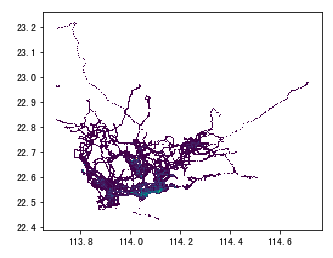
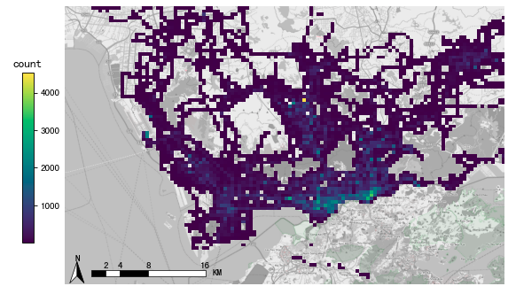
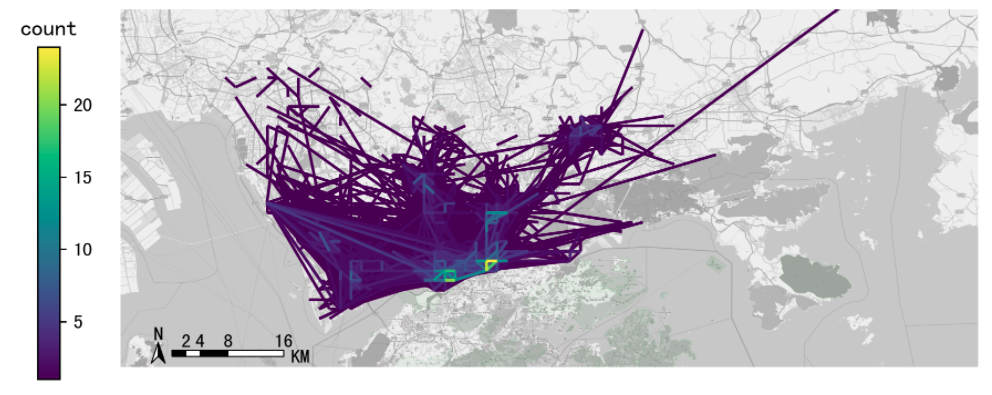
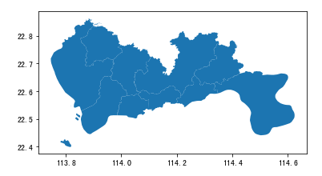
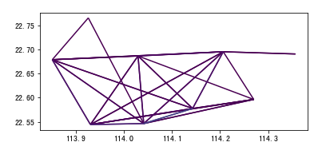
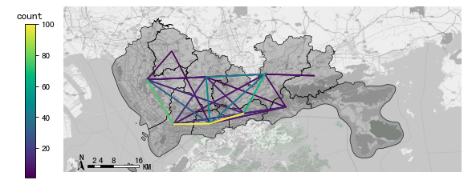

.. _example:

******************************
使用样例
******************************

出租车GPS栅格化、OD提取与可视化
=========================================

下面例子展示如何使用TransBigData工具快速地处理出租车GPS数据。

读取数据
------------------

::

    #读取数据    
    import pandas as pd
    data = pd.read_csv('TaxiData-Sample.csv',header = None) 
    data.columns = ['VehicleNum','time','slon','slat','OpenStatus','Speed'] 
    data

.. image:: _static/WX20211021-192131@2x.png
   :height: 300

GPS数据的栅格化
------------------

以栅格形式表达数据分布是最基本的表达方法。GPS数据经过栅格化后，每个数据点都含有对应的栅格信息，采用栅格表达数据的分布时，其表示的分布情况与真实情况接近。如果要使用TransBigData工具进行栅格首先需要确定栅格化的参数，参数可以帮助我们快速进行栅格化::

	#导入TransBigData包
	import transbigdata as tbd   
	#定义范围
	bounds = [113.7, 22.42, 114.3, 22.8]
	#获取栅格化参数，通过accuracy控制栅格大小（米）
	params = tbd.grid_params(bounds,accuracy = 500)

取得栅格化参数后，将GPS对应至栅格，由LONCOL与LATCOL两列共同指定一个栅格::

	#将GPS栅格化
	data['LONCOL'],data['LATCOL'] = tbd.GPS_to_grids(data['Lng'],data['Lat'],params)
	data = data[(data['LONCOL']>0)&(data['LATCOL']>0)]

统计每个栅格的数据量::

	#集计栅格数据量
	datatest = data.groupby(['LONCOL','LATCOL'])['VehicleNum'].count().reset_index()

生成栅格的地理图形，并将它转化为GeoDataFrame::

	#生成栅格地理图形
	datatest['geometry'] = tbd.gridid_to_polygon(datatest['LONCOL'],datatest['LATCOL'],params)
	#转为GeoDataFrame
	import geopandas as gpd
	datatest = gpd.GeoDataFrame(datatest)

绘制栅格测试是否成功::

	#绘制
	datatest.plot(column = 'VehicleNum')

添加底图指北针，添加色标::

	#创建图框
	import matplotlib.pyplot as plt
	import plot_map
	fig =plt.figure(1,(8,8),dpi=80)
	ax =plt.subplot(111)
	plt.sca(ax)
	#添加地图底图
	tbd.plot_map(plt,bounds,zoom = 12,style = 4)
	#绘制colorbar
	cax = plt.axes([0.05, 0.33, 0.02, 0.3])
	plt.title('count')
	plt.sca(ax)
	#绘制栅格
	datatest.plot(ax = ax,column = 'VehicleNum',cax = cax,legend = True)
	#添加比例尺和指北针
	tbd.plotscale(ax,bounds = bounds,textsize = 10,compasssize = 1,accuracy = 2000,rect = [0.06,0.03])
	plt.axis('off')
	plt.xlim(bounds[0],bounds[2])
	plt.ylim(bounds[1],bounds[3])
	plt.show()

提取出行OD
------------------

使用tbd.taxigps_to_od方法，传入对应的列名，即可提取出行OD::

    #从GPS数据提取OD
    oddata = tbd.taxigps_to_od(data,col = ['VehicleNum','time','slon','slat','OpenStatus'])
    oddata

.. image:: _static/WX20211021-190104@2x.png
   :height: 300

OD栅格集计
------------------

对提取出的OD进行OD的栅格集计::

    #定义研究范围
   bounds = [113.6,22.4,114.8,22.9]
   #输入研究范围边界bounds与栅格宽度accuracy，获取栅格化参数
   params = tbd.grid_params(bounds = bounds,accuracy = 1500)
   #栅格化OD并集计
   od_gdf = tbd.odagg_grid(oddata,params)
   od_gdf.plot(column = 'count')

.. image:: _static/WX20211021-190524@2x.png
   :height: 200

底图加载
------------------

使用plot_map方法添加地图底图，plotscale添加比例尺和指北针::

	#创建图框
	import matplotlib.pyplot as plt
	fig =plt.figure(1,(8,8),dpi=250)
	ax =plt.subplot(111)
	plt.sca(ax)
	#添加地图底图
	tbd.plot_map(plt,bounds,zoom = 12,style = 4)
	#绘制colorbar
	cax = plt.axes([0.05, 0.33, 0.02, 0.3])
	plt.title('count')
	plt.sca(ax)
	#绘制OD
	od_gdf.plot(ax = ax,column = 'count',cax = cax,legend = True)
	#添加比例尺和指北针
	tbd.plotscale(ax,bounds = bounds,textsize = 10,compasssize = 1,accuracy = 2000,rect = [0.06,0.03],zorder = 10)
	plt.axis('off')
	plt.xlim(bounds[0],bounds[2])
	plt.ylim(bounds[1],bounds[3])
	plt.show()

OD小区集计
------------------

TransBigData工具也支持对OD进行小区范围的集计，首先读取区域的地理信息::

	#读取区域信息
	import geopandas as gpd
	sz = gpd.read_file(r'sz.json')
	sz.crs = None
	sz.plot()

集计到小区（不传入栅格化参数时，直接用经纬度匹配）::

	#OD集计到小区（在不传入栅格化参数时，直接用经纬度匹配）
	od_gdf = tbd.odagg_shape(oddata,sz,round_accuracy=6)
	od_gdf.plot(column = 'count')

传入栅格化参数时，会先栅格化后匹配，可加快匹配速度，数据量大时建议使用::

	#OD集计到小区（传入栅格化参数时，先栅格化后匹配，可加快匹配速度，数据量大时建议使用）
	od_gdf = tbd.odagg_shape(oddata,sz,params = params)
	od_gdf.plot(column = 'count')

接下来,再加上底图可视化::

	#创建图框
	import matplotlib.pyplot as plt
	fig =plt.figure(1,(8,8),dpi=80)
	ax =plt.subplot(111)
	plt.sca(ax)
	#添加地图底图
	tbd.plot_map(plt,bounds,zoom = 12,style = 4)
	#绘制colorbar
	cax = plt.axes([0.05, 0.33, 0.02, 0.3])
	plt.title('count')
	plt.sca(ax)
	#绘制OD
	od_gdf.plot(ax = ax,vmax = 100,column = 'count',cax = cax,legend = True)
	#绘制小区底图
	sz.plot(ax = ax,edgecolor = (0,0,0,1),facecolor = (0,0,0,0.2),linewidths=0.5)
	#添加比例尺和指北针
	tbd.plotscale(ax,bounds = bounds,textsize = 10,compasssize = 1,accuracy = 2000,rect = [0.06,0.03],zorder = 10)
	plt.axis('off')
	plt.xlim(bounds[0],bounds[2])
	plt.ylim(bounds[1],bounds[3])
	plt.show()

