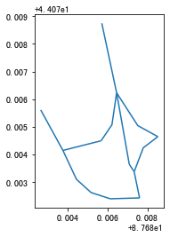
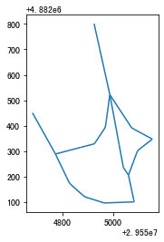

.. _gisprocess:

.. currentmodule:: transbigdata

******************************
GIS处理
******************************

近邻匹配
================

.. autofunction:: ckdnearest

.. autofunction:: ckdnearest_point

.. autofunction:: ckdnearest_line

| 下面的案例展示如何用TransBigData包进行点与点、点与线的近邻匹配。该方法使用的是KDTree算法，可查看wiki：https://en.wikipedia.org/wiki/K-d_tree，算法复杂度为o(log(n))

点与点匹配（DataFrame与DataFrame）
----------------------------------

| 导入TransBigData包。
| 生成两个GeoDataFrame表，用于测试

.. ipython:: python

    import transbigdata as tbd
    import pandas as pd
    import geopandas as gpd
    from shapely.geometry import LineString
    dfA = gpd.GeoDataFrame([[1,2],[2,4],[2,6],
                            [2,10],[24,6],[21,6],
                            [22,6]],columns = ['lon1','lat1'])
    dfA
    dfB = gpd.GeoDataFrame([[1,3],[2,5],[2,2]],columns = ['lon','lat'])
    dfB

| 使用 :func:`transbigdata.ckdnearest` 进行点与点匹配，如果是DataFrame与DataFrame匹配（不含有地理信息），则需要指定前后两个表的经纬度列

.. ipython:: python

    tbd.ckdnearest(dfA,dfB,Aname=['lon1','lat1'],Bname=['lon','lat'])

点与点匹配（GeoDataFrame与GeoDataFrame）
----------------------------------------

将A表B表变为含有点信息的GeoDataFrame

.. ipython:: python

    dfA['geometry'] = gpd.points_from_xy(dfA['lon1'],dfA['lat1'])
    dfA
    dfB['geometry'] = gpd.points_from_xy(dfB['lon'],dfB['lat'])
    dfB

| 使用 :func:`transbigdata.ckdnearest_point` 进行点与点匹配

.. ipython:: python
    
    tbd.ckdnearest_point(dfA,dfB)

点与线匹配（GeoDataFrame与GeoDataFrame）
----------------------------------------

将A表变为地理点，B表为线

.. ipython:: python

    dfA['geometry'] = gpd.points_from_xy(dfA['lon1'],dfA['lat1'])
    dfB['geometry'] = [LineString([[1,1],[1.5,2.5],[3.2,4]]),
                       LineString([[1,0],[1.5,0],[4,0]]),
                        LineString([[1,-1],[1.5,-2],[4,-4]])]
    dfB

    tbd.ckdnearest_line(dfA,dfB)

打断线
===============

在实际应用中，我们可能会需要把很长的线打断为很多子线段，每一条线段不要超过一定的最大长度，此时则可以使用TransBigData包中的splitline_with_length方法。

.. autofunction:: splitline_with_length

下面演示如何将线打断为100米一段的线段

::

    #读取线要素
    import geopandas as gpd
    Centerline = gpd.read_file(r'test_lines.json')
    Centerline.plot()

::

    #转换线为投影坐标系
    Centerline.crs = {'init':'epsg:4326'}
    Centerline = Centerline.to_crs(epsg = '4517')
    #计算线的长度
    Centerline['length'] = Centerline.length
    Centerline

.. raw:: html

    

    
    <table border="1" class="dataframe">
      <thead>
        <tr style="text-align: right;">
          <th></th>
          <th>Id</th>
          <th>geometry</th>
          <th>length</th>
        </tr>
      </thead>
      <tbody>
        <tr>
          <th>0</th>
          <td>0</td>
          <td>LINESTRING (29554925.232 4882800.694, 29554987...</td>
          <td>285.503444</td>
        </tr>
        <tr>
          <th>1</th>
          <td>0</td>
          <td>LINESTRING (29554682.635 4882450.554, 29554773...</td>
          <td>185.482276</td>
        </tr>
        <tr>
          <th>2</th>
          <td>0</td>
          <td>LINESTRING (29554987.079 4882521.969, 29555040...</td>
          <td>291.399180</td>
        </tr>
        <tr>
          <th>3</th>
          <td>0</td>
          <td>LINESTRING (29554987.079 4882521.969, 29555073...</td>
          <td>248.881529</td>
        </tr>
        <tr>
          <th>4</th>
          <td>0</td>
          <td>LINESTRING (29554987.079 4882521.969, 29554969...</td>
          <td>207.571197</td>
        </tr>
        <tr>
          <th>5</th>
          <td>0</td>
          <td>LINESTRING (29554773.177 4882288.671, 29554828...</td>
          <td>406.251357</td>
        </tr>
        <tr>
          <th>6</th>
          <td>0</td>
          <td>LINESTRING (29554773.177 4882288.671, 29554926...</td>
          <td>158.114403</td>
        </tr>
        <tr>
          <th>7</th>
          <td>0</td>
          <td>LINESTRING (29555060.286 4882205.456, 29555082...</td>
          <td>107.426629</td>
        </tr>
        <tr>
          <th>8</th>
          <td>0</td>
          <td>LINESTRING (29555040.278 4882235.468, 29555060...</td>
          <td>36.069941</td>
        </tr>
        <tr>
          <th>9</th>
          <td>0</td>
          <td>LINESTRING (29555060.286 4882205.456, 29555095...</td>
          <td>176.695446</td>
        </tr>
      </tbody>
    </table>
    

::

    #将线打断为最长100米的线段
    import transbigdata as tbd
    splitedline = tbd.splitline_with_length(Centerline,maxlength = 100)

::

    #打断后线型不变
    splitedline.plot()

::

    #但内容已经变成一段一段了
    splitedline

.. raw:: html

    

    
    <table border="1" class="dataframe">
      <thead>
        <tr style="text-align: right;">
          <th></th>
          <th>geometry</th>
          <th>id</th>
          <th>length</th>
        </tr>
      </thead>
      <tbody>
        <tr>
          <th>0</th>
          <td>LINESTRING (29554925.232 4882800.694, 29554927...</td>
          <td>0</td>
          <td>100.000000</td>
        </tr>
        <tr>
          <th>1</th>
          <td>LINESTRING (29554946.894 4882703.068, 29554949...</td>
          <td>0</td>
          <td>100.000000</td>
        </tr>
        <tr>
          <th>2</th>
          <td>LINESTRING (29554968.557 4882605.443, 29554970...</td>
          <td>0</td>
          <td>85.503444</td>
        </tr>
        <tr>
          <th>0</th>
          <td>LINESTRING (29554682.635 4882450.554, 29554688...</td>
          <td>1</td>
          <td>100.000000</td>
        </tr>
        <tr>
          <th>1</th>
          <td>LINESTRING (29554731.449 4882363.277, 29554736...</td>
          <td>1</td>
          <td>85.482276</td>
        </tr>
        <tr>
          <th>0</th>
          <td>LINESTRING (29554987.079 4882521.969, 29554989...</td>
          <td>2</td>
          <td>100.000000</td>
        </tr>
        <tr>
          <th>1</th>
          <td>LINESTRING (29555005.335 4882423.650, 29555007...</td>
          <td>2</td>
          <td>100.000000</td>
        </tr>
        <tr>
          <th>2</th>
          <td>LINESTRING (29555023.592 4882325.331, 29555025...</td>
          <td>2</td>
          <td>91.399180</td>
        </tr>
        <tr>
          <th>0</th>
          <td>LINESTRING (29554987.079 4882521.969, 29554993...</td>
          <td>3</td>
          <td>100.000000</td>
        </tr>
        <tr>
          <th>1</th>
          <td>LINESTRING (29555042.051 4882438.435, 29555048...</td>
          <td>3</td>
          <td>99.855617</td>
        </tr>
        <tr>
          <th>2</th>
          <td>LINESTRING (29555111.265 4882370.450, 29555116...</td>
          <td>3</td>
          <td>48.881529</td>
        </tr>
        <tr>
          <th>0</th>
          <td>LINESTRING (29554987.079 4882521.969, 29554985...</td>
          <td>4</td>
          <td>100.000000</td>
        </tr>
        <tr>
          <th>1</th>
          <td>LINESTRING (29554973.413 4882422.908, 29554971...</td>
          <td>4</td>
          <td>99.756943</td>
        </tr>
        <tr>
          <th>2</th>
          <td>LINESTRING (29554930.341 4882335.023, 29554929...</td>
          <td>4</td>
          <td>7.571197</td>
        </tr>
        <tr>
          <th>0</th>
          <td>LINESTRING (29554773.177 4882288.671, 29554777...</td>
          <td>5</td>
          <td>100.000000</td>
        </tr>
        <tr>
          <th>1</th>
          <td>LINESTRING (29554816.361 4882198.476, 29554821...</td>
          <td>5</td>
          <td>99.782969</td>
        </tr>
        <tr>
          <th>2</th>
          <td>LINESTRING (29554882.199 4882125.314, 29554891...</td>
          <td>5</td>
          <td>99.745378</td>
        </tr>
        <tr>
          <th>3</th>
          <td>LINESTRING (29554976.612 4882096.588, 29554987...</td>
          <td>5</td>
          <td>100.000000</td>
        </tr>
        <tr>
          <th>4</th>
          <td>LINESTRING (29555076.548 4882100.189, 29555077...</td>
          <td>5</td>
          <td>6.251357</td>
        </tr>
        <tr>
          <th>0</th>
          <td>LINESTRING (29554773.177 4882288.671, 29554783...</td>
          <td>6</td>
          <td>100.000000</td>
        </tr>
        <tr>
          <th>1</th>
          <td>LINESTRING (29554869.914 4882314.006, 29554876...</td>
          <td>6</td>
          <td>58.114403</td>
        </tr>
        <tr>
          <th>0</th>
          <td>LINESTRING (29555060.286 4882205.456, 29555062...</td>
          <td>7</td>
          <td>100.000000</td>
        </tr>
        <tr>
          <th>1</th>
          <td>LINESTRING (29555081.239 4882107.675, 29555081...</td>
          <td>7</td>
          <td>7.426629</td>
        </tr>
        <tr>
          <th>0</th>
          <td>LINESTRING (29555040.278 4882235.468, 29555042...</td>
          <td>8</td>
          <td>36.069941</td>
        </tr>
        <tr>
          <th>0</th>
          <td>LINESTRING (29555060.286 4882205.456, 29555064...</td>
          <td>9</td>
          <td>100.000000</td>
        </tr>
        <tr>
          <th>1</th>
          <td>LINESTRING (29555094.981 4882299.244, 29555100...</td>
          <td>9</td>
          <td>76.419694</td>
        </tr>
      </tbody>
    </table>
    

面要素处理
========================

.. autofunction:: merge_polygon

.. autofunction:: polyon_exterior

confidence ellipse
========================

.. autofunction:: ellipse_params

.. autofunction:: ellipse_plot

用法
-------------------------

::

    import pandas as pd
    import transbigdata as tbd
    import numpy as np
    #生成测试用数据
    data = np.random.uniform(1,10,(100,2))
    data[:,1:] = 0.5*data[:,0:1]+np.random.uniform(-2,2,(100,1))
    data = pd.DataFrame(data,columns = ['x','y'])
    
    #绘制数据分布
    import matplotlib.pyplot as plt
    plt.figure(1,(5,5))
    #绘制数据点
    plt.scatter(data['x'],data['y'],s = 0.5)
    #绘制坐标轴
    plt.plot([-10,10],[0,0],c = 'k')
    plt.plot([0,0],[-10,10],c = 'k')
    plt.xlim(-15,15)
    plt.ylim(-15,15)
    plt.show()

.. image:: gisprocess/output_1_0.png

输入数据与xy坐标所在列名，置信度，估计椭圆参数
分别代表[中心点坐标，短轴，长轴，角度，面积，扁率

::

    
    ellip_params = tbd.ellipse_params(data,confidence=95,col = ['x','y'])
    ellip_params

.. parsed-literal::

    [array([5.78928146, 2.88466235]),
     4.6981983145616875,
     14.04315715927693,
     -58.15524535916836,
     51.8186366184246,
     0.6654457212665993]

再用tbd.ellipse_plot绘制置信椭圆

::

    #绘制数据分布
    import matplotlib.pyplot as plt
    plt.figure(1,(5,5))
    ax = plt.subplot(111)
    #绘制数据点
    plt.scatter(data['x'],data['y'],s = 0.5)
    #获取置信椭圆参数并绘制椭圆
    #99%置信椭圆
    ellip_params = tbd.ellipse_params(data,confidence=99,col = ['x','y'])
    tbd.ellipse_plot(ellip_params,ax,fill = False,edgecolor = 'r',linewidth = 1)
    #95%置信椭圆
    ellip_params = tbd.ellipse_params(data,confidence=95,col = ['x','y'])
    tbd.ellipse_plot(ellip_params,ax,fill = False,edgecolor = 'b',linewidth = 1)
    #90%置信椭圆
    ellip_params = tbd.ellipse_params(data,confidence=90,col = ['x','y'])
    tbd.ellipse_plot(ellip_params,ax,fill = False,edgecolor = 'k',linewidth = 1)
    #绘制坐标轴
    plt.plot([-10,10],[0,0],c = 'k')
    plt.plot([0,0],[-10,10],c = 'k')
    plt.xlim(-15,15)
    plt.ylim(-15,15)
    plt.show()

.. image:: gisprocess/output_3_0.png

