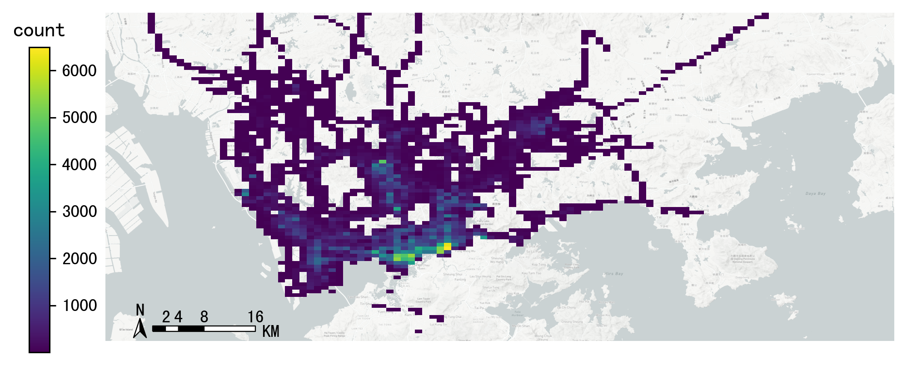

.. _grids:
.. currentmodule:: transbigdata

***************
Data Gridding
***************

.. autosummary::
   
    area_to_grid
    area_to_params
    GPS_to_grid
    grid_to_centre
    grid_to_polygon
    grid_to_area
    grid_to_params
    grid_params_optimize
    geohash_encode
    geohash_decode
    geohash_togrid

Gridding Framework
--------------------------

.. image:: grids/1648715064154.png

.. autofunction:: area_to_grid

.. autofunction:: area_to_params

.. autofunction:: GPS_to_grid

.. autofunction:: grid_to_centre

.. autofunction:: grid_to_polygon

.. autofunction:: grid_to_area
    
.. autofunction:: grid_to_params

.. autofunction:: grid_params_optimize

geohash encoding
--------------------------

Geohash is a public geocoding system that encodes latitude and longitude geographic locations into strings of letters and numbers, which can also be decoded back to latitude and longitude. Each string represents a grid number, and the longer the length of the string, the higher the precision. According to wiki <https://en.wikipedia.org/wiki/Geohash>, the table of Geohash string lengths corresponding to precision is as follows.

========================= ======== ======== ========= ========= ========
geohash length(precision) lat bits lng bits lat error lng error km error
========================= ======== ======== ========= ========= ========
1                         2        3        ±23       ±23       ±2500
2                         5        5        ±2.8      ±5.6      ±630
3                         7        8        ±0.70     ±0.70     ±78
4                         10       10       ±0.087    ±0.18     ±20
5                         12       13       ±0.022    ±0.022    ±2.4
6                         15       15       ±0.0027   ±0.0055   ±0.61
7                         17       18       ±0.00068  ±0.00068  ±0.076
8                         20       20       ±0.000085 ±0.00017  ±0.019
========================= ======== ======== ========= ========= ========

TransBigData also provides the function based on Geohash, the three functions are as follows:

.. autofunction:: geohash_encode

.. autofunction:: geohash_decode

.. autofunction:: geohash_togrid

Compared to the rectangular grid processing method provided in the TransBigData package, geohash is slower and does not provide a freely defined grid size. The following example shows how to use these three functions to utilize the geohash encoding, decoding, and the visualization

::

    import transbigdata as tbd
    import pandas as pd
    import geopandas as gpd
    #read data    
    data = pd.read_csv('TaxiData-Sample.csv',header = None) 
    data.columns = ['VehicleNum','time','slon','slat','OpenStatus','Speed'] 

::

    #encode geohash
    data['geohash'] = tbd.geohash_encode(data['slon'],data['slat'],precision=6)
    data['geohash']

.. parsed-literal::

    0         ws0btw
    1         ws0btz
    2         ws0btz
    3         ws0btz
    4         ws0by4
               ...  
    544994    ws131q
    544995    ws1313
    544996    ws131f
    544997    ws1361
    544998    ws10tq
    Name: geohash, Length: 544999, dtype: object

::

    #Aggregate
    dataagg = data.groupby(['geohash'])['VehicleNum'].count().reset_index()
    dataagg['lon_geohash'],dataagg['lat_geohash'] = tbd.geohash_decode(dataagg['geohash'])
    dataagg['geometry'] = tbd.geohash_togrid(dataagg['geohash'])
    dataagg = gpd.GeoDataFrame(dataagg)
    dataagg

.. raw:: html

    

    
    <table border="1" class="dataframe">
      <thead>
        <tr style="text-align: right;">
          <th></th>
          <th>geohash</th>
          <th>VehicleNum</th>
          <th>lon_geohash</th>
          <th>lat_geohash</th>
          <th>geometry</th>
        </tr>
      </thead>
      <tbody>
        <tr>
          <th>0</th>
          <td>w3uf3x</td>
          <td>1</td>
          <td>108.</td>
          <td>10.28</td>
          <td>POLYGON ((107.99561 10.27771, 107.99561 10.283...</td>
        </tr>
        <tr>
          <th>1</th>
          <td>webzz6</td>
          <td>12</td>
          <td>113.9</td>
          <td>22.47</td>
          <td>POLYGON ((113.87329 22.46704, 113.87329 22.472...</td>
        </tr>
        <tr>
          <th>2</th>
          <td>webzz7</td>
          <td>21</td>
          <td>113.9</td>
          <td>22.48</td>
          <td>POLYGON ((113.87329 22.47253, 113.87329 22.478...</td>
        </tr>
        <tr>
          <th>3</th>
          <td>webzzd</td>
          <td>1</td>
          <td>113.9</td>
          <td>22.47</td>
          <td>POLYGON ((113.88428 22.46704, 113.88428 22.472...</td>
        </tr>
        <tr>
          <th>4</th>
          <td>webzzf</td>
          <td>2</td>
          <td>113.9</td>
          <td>22.47</td>
          <td>POLYGON ((113.89526 22.46704, 113.89526 22.472...</td>
        </tr>
        <tr>
          <th>...</th>
          <td>...</td>
          <td>...</td>
          <td>...</td>
          <td>...</td>
          <td>...</td>
        </tr>
        <tr>
          <th>2022</th>
          <td>ws1d9u</td>
          <td>1</td>
          <td>114.7</td>
          <td>22.96</td>
          <td>POLYGON ((114.68628 22.96143, 114.68628 22.966...</td>
        </tr>
        <tr>
          <th>2023</th>
          <td>ws1ddh</td>
          <td>6</td>
          <td>114.7</td>
          <td>22.96</td>
          <td>POLYGON ((114.69727 22.96143, 114.69727 22.966...</td>
        </tr>
        <tr>
          <th>2024</th>
          <td>ws1ddj</td>
          <td>2</td>
          <td>114.7</td>
          <td>22.97</td>
          <td>POLYGON ((114.69727 22.96692, 114.69727 22.972...</td>
        </tr>
        <tr>
          <th>2025</th>
          <td>ws1ddm</td>
          <td>4</td>
          <td>114.7</td>
          <td>22.97</td>
          <td>POLYGON ((114.70825 22.96692, 114.70825 22.972...</td>
        </tr>
        <tr>
          <th>2026</th>
          <td>ws1ddq</td>
          <td>7</td>
          <td>114.7</td>
          <td>22.98</td>
          <td>POLYGON ((114.70825 22.97241, 114.70825 22.977...</td>
        </tr>
      </tbody>
    </table>
    
2027 rows × 5 columns

    

::

    bounds = [113.6,22.4,114.8,22.9]
    import matplotlib.pyplot as plt
    import plot_map
    fig =plt.figure(1,(8,8),dpi=280)
    ax =plt.subplot(111)
    plt.sca(ax)
    tbd.plot_map(plt,bounds,zoom = 12,style = 4)
    cax = plt.axes([0.05, 0.33, 0.02, 0.3])
    plt.title('count')
    plt.sca(ax)
    dataagg.plot(ax = ax,column = 'VehicleNum',cax = cax,legend = True)
    tbd.plotscale(ax,bounds = bounds,textsize = 10,compasssize = 1,accuracy = 2000,rect = [0.06,0.03],zorder = 10)
    plt.axis('off')
    plt.xlim(bounds[0],bounds[2])
    plt.ylim(bounds[1],bounds[3])
    plt.show()

