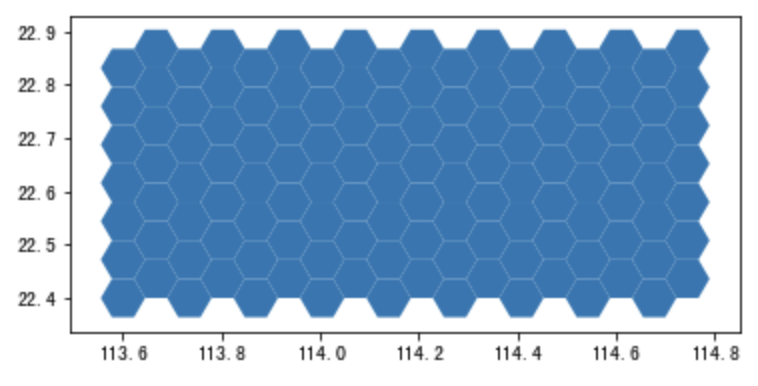

.. _grids:

***************
栅格化
***************

方形栅格渔网的生成与对应
=============================

.. function:: transbigdata.rect_grids(bounds,accuracy = 500)

生成研究范围内的方形栅格::

    #设定范围
    bounds = [lon1,lat1,lon2,lat2]
    grid,params = tbd.rect_grids(bounds,accuracy = 500)

输入参数

=========== ===========
参数         描述                                                         
=========== ===========
bounds       底图的绘图边界，[lon1,lat1,lon2,lat2] (WGS84坐标系) 其中，lon1,lat1是左下角坐标，lon2,lat2是右上角坐标 
accuracy     栅格大小     
=========== ===========                                            

输出

=========== ===========
参数         描述                                                         
=========== ===========
grid            栅格的GeoDataFrame，其中LONCOL与LATCOL为栅格的编号，HBLON与HBLAT为栅格的中心点坐标 
params          栅格参数(lonStart,latStart,deltaLon,deltaLat)，分别为栅格左下角坐标与单个栅格的经纬度长宽
=========== ===========

.. function:: transbigdata.grid_params(bounds,accuracy = 500)

栅格参数获取
输入经纬度范围bounds，输出栅格参数::

    bounds = [113.75194,22.447837,114.624187,22.864748]
    tbd.grid_params(bounds,accuracy = 500)

.. function:: transbigdata.GPS_to_grids(lon,lat,params)

GPS数据对应栅格编号
输入数据的经纬度列与栅格参数，输出对应的栅格编号::

    data['LONCOL'],data['LATCOL'] = tbd.GPS_to_grids(data['Lng'],data['Lat'],params)

.. function:: transbigdata.grids_centre(loncol,latcol,params)

栅格编号对应栅格中心点经纬度。输入数据的栅格编号与栅格参数，输出对应的栅格中心点::

    data['HBLON'],data['HBLAT'] = tbd.grids_centre(data['LONCOL'],data['LATCOL'],params)

.. function:: transbigdata.gridid_to_polygon(loncol,latcol,params)

栅格编号生成栅格的地理信息列。输入数据的栅格编号与栅格参数，输出对应的地理信息列::

    data['geometry'] = tbd.gridid_to_polygon(data['LONCOL'],data['LATCOL'],params)

六边形渔网生成
=============================

.. function:: transbigdata.hexagon_grids(bounds,accuracy = 500)

生成研究范围内的六边形渔网  ::

    
    #设定范围
    bounds = [113.6,22.4,114.8,22.9]
    hexagon = tbd.hexagon_grids(bounds,accuracy = 5000)
    hexagon.plot()

