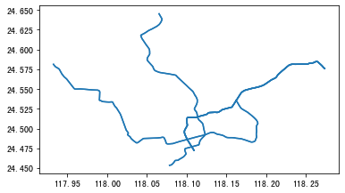
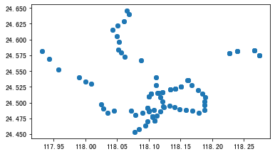
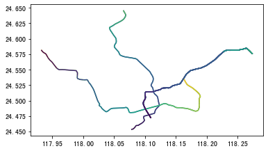
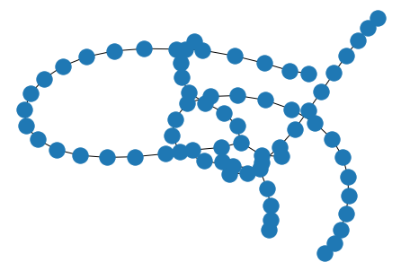

地铁网络拓扑建模
================

下面的案例展示如何用TransBigData包抓取地铁线路，并构建地铁线网的拓扑网络模型

爬取地铁线路
------------

首先爬取地铁线路使用tbd.getbusdata方法，输入城市跟公交或地铁线路名称的关键词，即可获取到线路数据，坐标系为wgs84。

::

    import transbigdata as tbd
    line,stop = tbd.getbusdata('厦门',['1号线','2号线','3号线'])

获取城市id: 厦门成功
1号线成功
2号线成功
3号线成功

::

    line.plot()

::

    stop.plot()

轨道断面信息获取
----------------

tbd.split_subwayline方法可以用轨道站点切分轨道线路，得到轨道断面信息（这一步骤主要在地铁客流可视化中有用）

::

    metroline_splited = tbd.split_subwayline(line,stop)
    metroline_splited.plot(column = 'o_project')

轨道网络拓扑模型构建
--------------------

同时我们也可以直接使用站点数据，构建地铁网络的拓扑结构模型，方便后续地铁出行路径的识别。这一功能依赖于networkx包。

::

    #构建拓扑模型
    import networkx as nx
    G = tbd.metro_network(stop)
    nx.draw(G)

