.. _plot_map:

.. currentmodule:: transbigdata

**************************
Load the basemap
**************************

.. autosummary::
   
    plot_map
    plotscale
    set_mapboxtoken
    set_imgsavepath
    read_imgsavepath
    read_mapboxtoken

Settings before start
--------------------------

| The TransBigData package provides the function of drawing map basemap on matplotlib. The basemap is provided by mapbox and the coordinate system is WGS84. If you want to use this function, you first need to click `This link <https://account.mapbox.com/auth/signin/?route-to=%22https://account.mapbox.com/%22>`__\  to register for a mapbox account. Register as a developer on the mapbox, and obtain a mapbox token.  `This link <https://docs.mapbox.com/help/getting-started/access-tokens/#how-access-tokens-work>`__\ introduces the function of mapbox token.
If you have obtained the mapbox token, you can use the following code to set the mapbox token for TransBigData (you only need to set it once, and you don’t need to reset it when you reopen python later)

::

    import transbigdata as tbd
    #Set your mapboxtoken with the following code
    tbd.set_mapboxtoken('pk.eyxxxxxxxxxx.xxxxxxxxx')
    # The token you applied for must be set in it.
    # Copying this line of code directly is invalid

In addition, you need to set the storage location of a map basemap. When the same location is displayed next time, the map will be read and loaded locally

::

    # Set your map basemap storage path
    # On linux or mac, the path is written like this.
    # Note that there is a backslash at the end
    tbd.set_imgsavepath(r'/Users/xxxx/xxxx/')

    # On windows, the path is written like this.
    # Finally, pay attention to two slashes to prevent escape
    tbd.set_imgsavepath(r'E:\pythonscript\xxx\\')

After setting, the next time you draw the base map, you will create a tileimg folder under the path you set, and put all the base maps in it. Try the following code to see if you can draw the base map successfully

::

    # Define display range
    bounds = [113.6,22.4,114.8,22.9]
    # Plot Frame
    import matplotlib.pyplot as plt
    fig =plt.figure(1,(8,8),dpi=250)
    ax =plt.subplot(111)
    plt.sca(ax)
    # Add map basemap
    tbd.plot_map(plt,bounds,zoom = 11,style = 4)
    # Add scale bar and north arrow
    tbd.plotscale(ax,bounds = bounds,textsize = 10,compasssize = 1,accuracy = 2000,rect = [0.06,0.03],zorder = 10)
    plt.axis('off')
    plt.xlim(bounds[0],bounds[2])
    plt.ylim(bounds[1],bounds[3])
    plt.show()

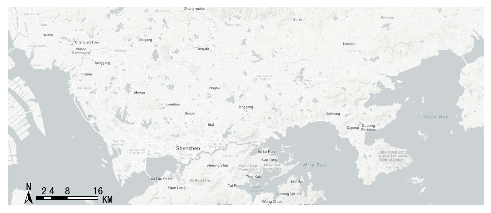

.. autofunction:: plot_map

Basemap style 1：streets
============================================

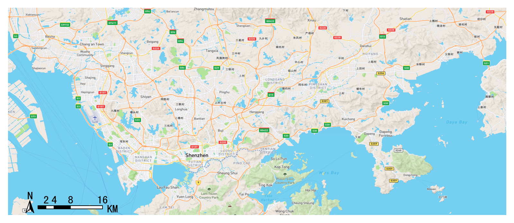

Basemap style 2：outdoors
============================================

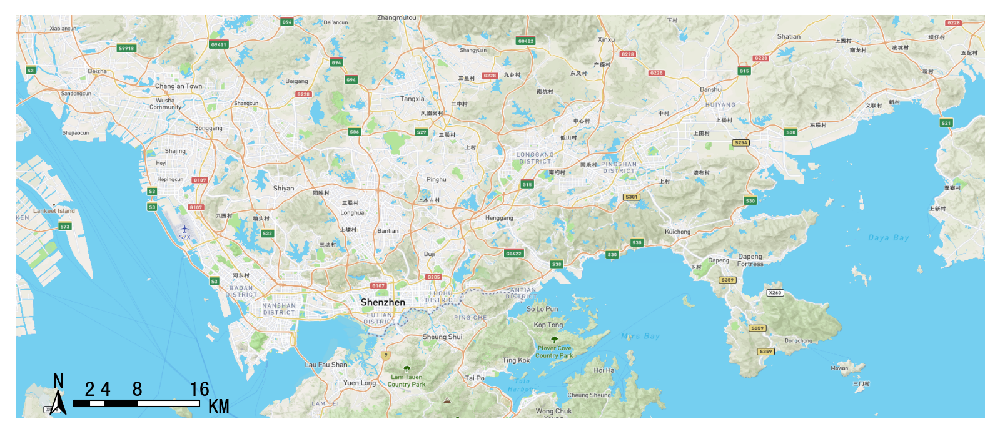

Basemap style 3：satellite
============================================

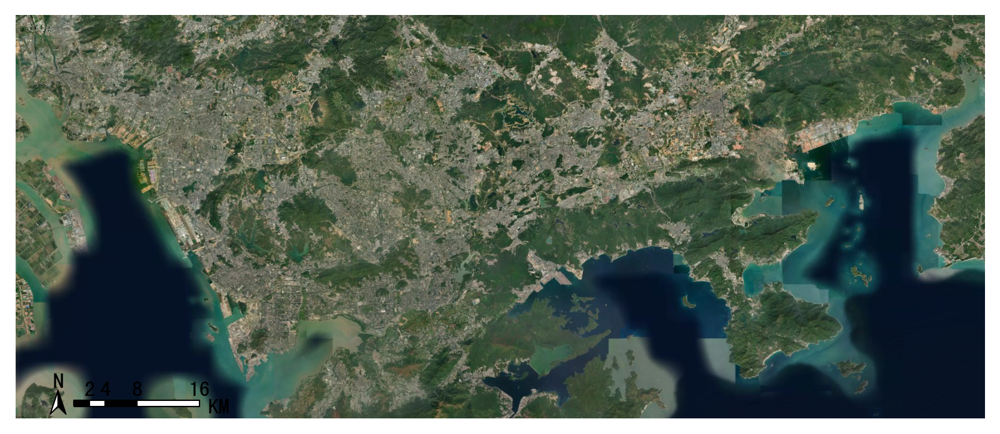

Basemap style 4：light
============================================

Basemap style 5：dark
============================================

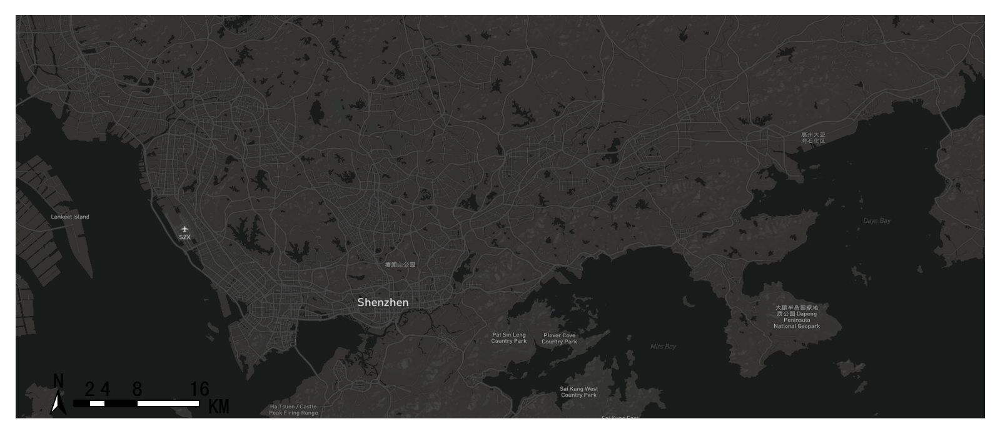

Basemap style 6：light-ch（中文）
============================================

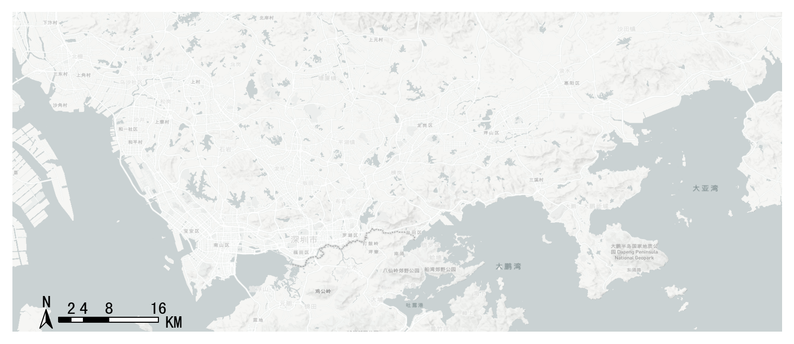

Basemap style 7：ice creem
============================================

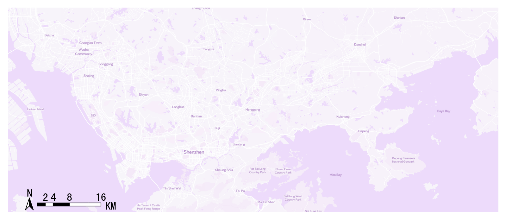

Basemap style 8：night
============================================

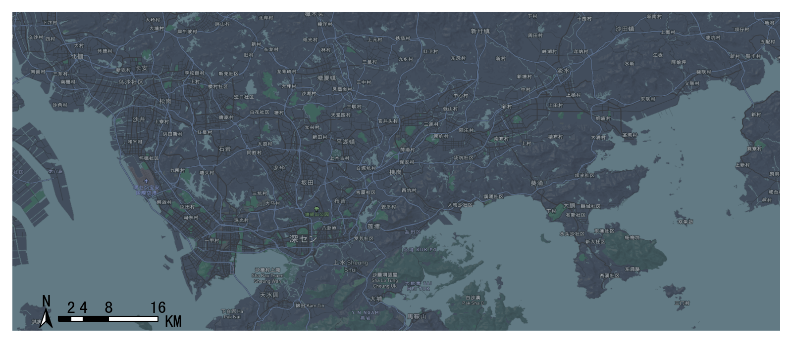

Basemap style 9：terrain
============================================

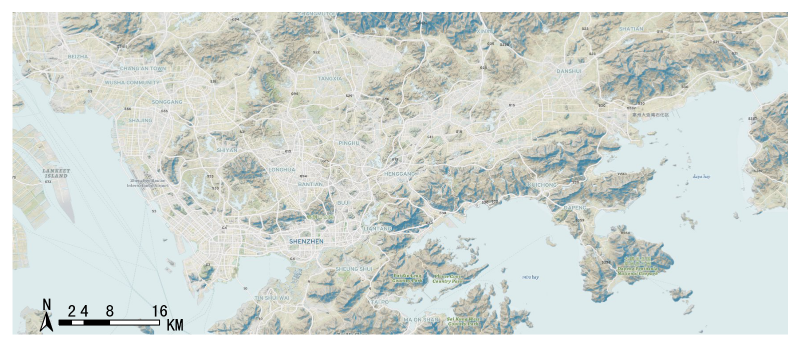

Basemap style 10：basic blue
============================================

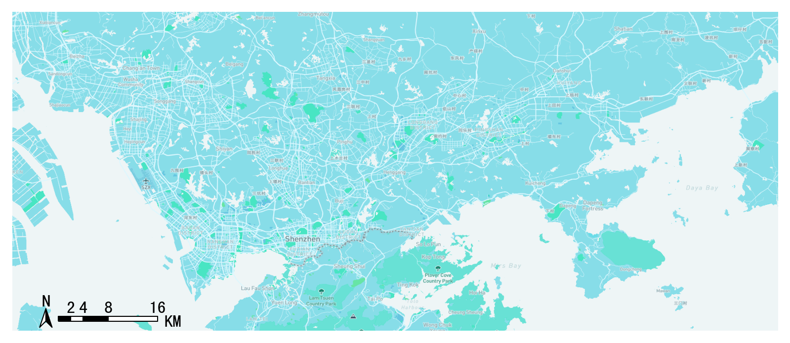

Basemap style 11：light(无标注)
============================================

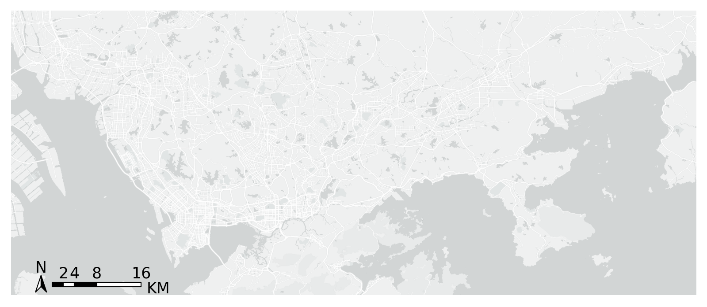

Basemap style 12：dark(无标注)
============================================

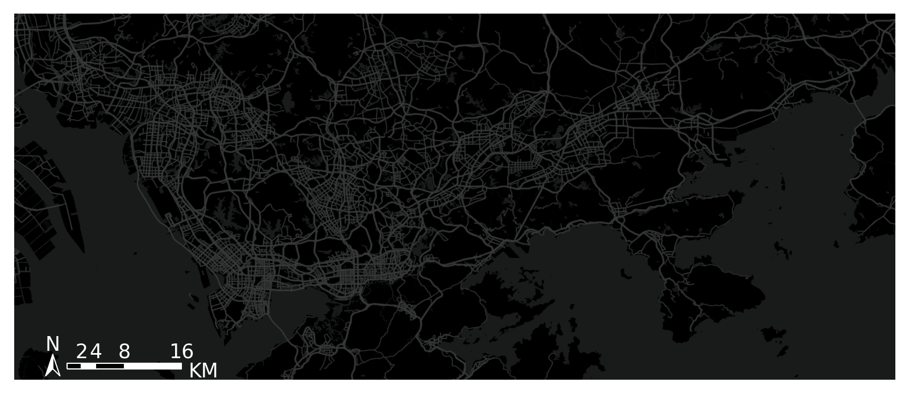

Self-defined style
============================================

support selfdefined mapbox style

::

    tbd.plot_map(plt,bounds,zoom = 11,style = 'mapbox://styles/ni1o1/cl38pljx0006r14qp7ioy7gcc')

Compass and scale
-------------------

.. autofunction:: plotscale

::

    tbd.plotscale(ax,bounds = bounds,textsize = 10,compasssize = 1,accuracy = 2000,rect = [0.06,0.03])  
