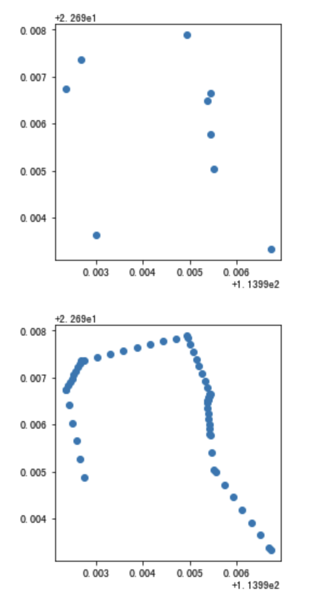

.. _traj:

******************************
轨迹数据处理
******************************

轨迹线型生成
==================

.. function:: transbigdata.points_to_traj(traj_points,col = ['Lng','Lat','ID'],timecol = None)

输入轨迹点，生成轨迹线型的GeoDataFrame

**输入**

traj_points : DataFrame
    轨迹点数据
col : List
    列名，按[经度,纬度,轨迹编号]的顺序
timecol : str
    可选，时间列的列名，如果给了则输出带有[经度,纬度,高度,时间]的geojson，可放入kepler中可视化轨迹

**输出**

traj : GeoDataFrame或json
    生成的轨迹数据，如果timecol没定义则为GeoDataFrame，否则为json

.. function:: transbigdata.dumpjson(data,path)

输入json数据，存储为文件。这个方法主要是解决numpy数值型无法兼容json包报错的问题

**输入**

data : json
    要储存的json数据
path : str
    保存的路径

轨迹增密
==================

.. function:: transbigdata.traj_densify(data,col = ['Vehicleid','Time','Lng','Lat'],timegap = 15)

轨迹点增密，确保每隔timegap秒会有一个轨迹点

**输入**

data : DataFrame
    数据
col : List
    列名，按[车辆ID,时间,经度,纬度]的顺序
timegap : number
    单位为秒，每隔多长时间插入一个轨迹点

**输出**

data1 : DataFrame
    处理后的数据

使用方法

::

    import transbigdata as tbd
    import pandas as pd
    #读取数据    
    data = pd.read_csv('TaxiData-Sample.csv',header = None) 
    data.columns = ['Vehicleid','Time','Lng','Lat','OpenStatus','Speed']      
    data['Time'] = pd.to_datetime(data['Time'])
    #轨迹增密前的采样间隔
    tbd.data_summary(data,col = ['Vehicleid','Time','Lng','Lat'],show_sample_duration=True)

::

    数据量
    -----------------
    数据总量 : 544999 条
    个体总量 : 180 个
    个体数据量均值 : 3027.77 条
    个体数据量上四分位 : 4056.25 条
    个体数据量中位数 : 2600.5 条
    个体数据量下四分位 : 1595.75 条

    数据时间段
    -----------------
    开始时间 : 2021-11-12 00:00:00
    结束时间 : 2021-11-12 23:59:59

    个体采样间隔
    -----------------
    均值 : 28.0 秒
    上四分位 : 30.0 秒
    中位数 : 20.0 秒
    下四分位 : 15.0 秒

进行轨迹增密，设置15秒一条数据::
    
    data1 = tbd.traj_densify(data,timegap = 15)
    #轨迹增密后的采样间隔
    tbd.data_summary(data1,show_sample_duration=True)

::

    数据量
    -----------------
    数据总量 : 1526524 条
    个体总量 : 180 个
    个体数据量均值 : 8480.69 条
    个体数据量上四分位 : 9554.75 条
    个体数据量中位数 : 8175.0 条
    个体数据量下四分位 : 7193.5 条

    数据时间段
    -----------------
    开始时间 : 2021-11-12 00:00:00
    结束时间 : 2021-11-12 23:59:59

    个体采样间隔
    -----------------
    均值 : 9.99 秒
    上四分位 : 15.0 秒
    中位数 : 11.0 秒
    下四分位 : 6.0 秒

增密后的效果

