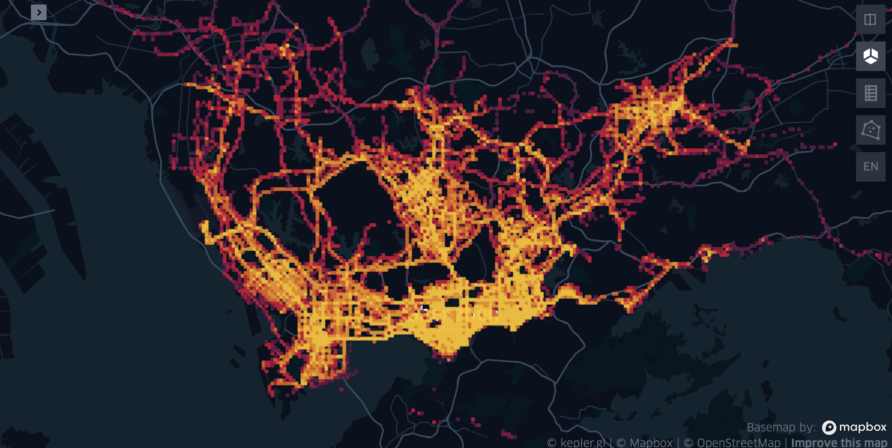
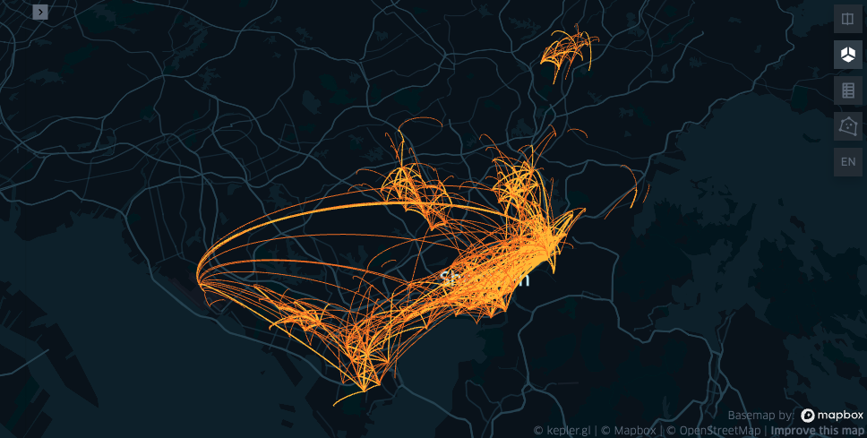

******************************
数据可视化
******************************

在jupyter中显示可视化的设置
--------------------------------------

| TransBigData包也依托于kepler.gl提供的可视化插件提供了一键数据整理与可视化的方法
| 使用此功能请先安装python的keplergl包

::

    pip install keplergl

如果要在jupyter notebook中显示可视化，则需要勾选jupyter-js-widgets（可能需要另外安装）和keplergl-jupyter两个插件

.. image:: _static/jupytersettings.png

数据点分布可视化
-------------------

.. function:: transbigdata.visualization_data(data,col =  ['lon','lat'],accuracy = 500,height = 500,maptype = 'point',zoom = 'auto')

输入数据点，集计并可视化

**输入**

data : DataFrame
    数据点分布
col : List
    列名，可输入不带权重的OD，按[经度，纬度]的顺序，此时会自动集计。
    也可输入带权重的OD，按[经度，纬度，数量]的顺序。
zoom : number
    地图缩放等级,默认'auto'自动选择
height : number
    地图图框高度
accuracy : number
    集计的栅格大小
maptype : str
    出图类型，'point'或者'heatmap'

**输出**

vmap : keplergl.keplergl.KeplerGl
    keplergl提供的可视化

使用方法::

    import transbigdata as tbd
    import pandas as pd
    #读取数据    
    data = pd.read_csv('TaxiData-Sample.csv',header = None) 
    data.columns = ['VehicleNum','Time','Lng','Lat','OpenStatus','Speed']
    #可视化数据点分布
    tbd.visualization_data(data,col = ['Lng','Lat'],accuracy=300)

轨迹可视化
-------------------

.. function:: transbigdata.visualization_trip(trajdata,col = ['Lng','Lat','ID','Time'],zoom = 10,height=500)

输入轨迹数据与列名，生成kepler的可视化

**输入**

trajdata : DataFrame
    轨迹点数据
col : List
    列名，按[经度,纬度,轨迹编号,时间]的顺序
zoom : number
    地图缩放等级
height : number
    地图图框高度

**输出**

vmap : keplergl.keplergl.KeplerGl
    keplergl提供的可视化

使用方法

::

    import transbigdata as tbd
    import pandas as pd
    #读取数据    
    data = pd.read_csv('TaxiData-Sample.csv',header = None) 
    data.columns = ['VehicleNum','Time','Lng','Lat','OpenStatus','Speed']  
    #轨迹数据可视化
    tbd.visualization_trip(data,col = ['Lng', 'Lat', 'VehicleNum', 'Time'])

.. image:: example-taxi/kepler-traj.png

OD可视化
--------------------

.. function:: transbigdata.visualization_od(oddata,col = ['slon','slat','elon','elat'],zoom = 'auto',height=500,accuracy = 500,mincount = 0)

输入od数据与列名，生成kepler的可视化

**输入**

oddata : DataFrame
    od数据
col : List
    列名，可输入不带权重的OD，按[起点经度，起点纬度，终点经度，终点纬度]的顺序，此时会自动集计。
    也可输入带权重的OD，按[起点经度，起点纬度，终点经度，终点纬度，数量]的顺序。
zoom : number
    地图缩放等级,默认'auto'自动选择
height : number
    地图图框高度
accuracy : number
    集计的栅格大小
mincount : number
    最小的od数，少于这个的od就不显示了

**输出**

vmap : keplergl.keplergl.KeplerGl
    keplergl提供的可视化

使用方法

::

    import transbigdata as tbd
    import pandas as pd
    #读取数据    
    data = pd.read_csv('TaxiData-Sample.csv',header = None) 
    data.columns = ['VehicleNum','Time','Lng','Lat','OpenStatus','Speed']
    #提取OD
    oddata = tbd.taxigps_to_od(data,col = ['VehicleNum','Time','Lng','Lat','OpenStatus'])
    #OD可视化
    tbd.visualization_od(oddata)

