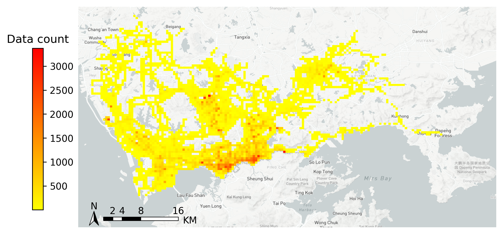
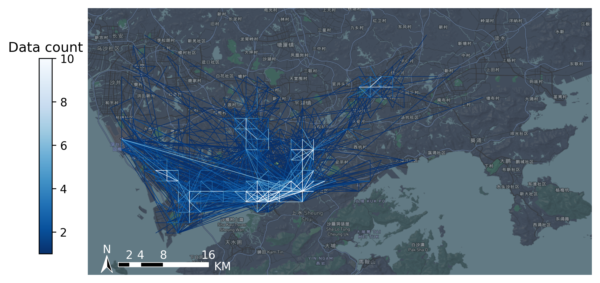

# Summary

In recent years, data generated in the field of transportation has begun to explode. Individual continuous tracking data, such as mobile phone data, IC smart card data, taxi GPS data, bus GPS data and bicycle sharing order data, also known as "spatio-temporal big data" or "Track &Trace data" [@harrison:2020], has great potential for applications in data-driven transportation research. These spatio-temporal big data typically require three aspects of information [@zhang:2021]: Who? When? Where? They are characterized by high data quality, large collection scope, and fine-grained spatio-temporal information, which can fully capture the daily activities of individuals and their travel behavior in the city in both temporal and spatial dimensions. The emergence of these data provides new ways and opportunities for potential transportation demand analysis and travel mechanism understanding in supporting urban transportation planning and management [@chen:2021; @zhang:2020]. However, processing with these multi-source spatio-temporal big data usually requires a series of similar processing procedure (e.g., data quality assessment, data preprocessing, data cleaning, data gridding, data aggregation, and data visualization). There is an urgent need for a one-size-fits-all tool that can adapt to the various processing demands of different transportation data in this field.

# **State of the art**

Typical processing for spatiotemporal data analysis involves multiple procedures, including data acquisition, data preprocessing, data analysis, data visualization, etc. Currently, there exists several open source packages in these domains:

- Data acquisition: In this aspect, existing software mainly provides data acquisition of basic geospatial data. `osmnx` [@boeing2017osmnx] is a Python package to download geospatial data from OpenStreetMap. Some packages provide tools to generate synthetic mobility data using standard mathematical models. `scikit-mobility` [@scikitmobility] is a library that allows for managing and generation of mobility data of various formats.
- Data preprocessing and data analysis: Spatio-temporal data in the field of transportation involves multiple source of data. Most existing tools are developed for specific type of data, such as trajectory data, air traffic data, etc. `MovingPandas` [@graser2019movingpandas] provides trajectory data structures and functions for data exploration and visualization. `PTRAIL` [@haidri2021ptrail] is a library for mobility data preprocessing especially in feature generation and trajectory interpolation. `traffic` [@Olive2019] is a toolbox for processing and analyzing air traffic data. `trackintel` [@axhausen2007definition] is a framework for spatio-temporal analysis of tracking data focusing on human mobility. `PySAL` [@pysal2007; @Rey2021] is a family of packages that allows for advanced geospatial data science, which supports the development of high-level applications.
- Data visualization: Apart from data processing, `MovingPandas` also support trajectory visualizations. `moveVis` [@2020moveVis] provides tools to visualize movement data and temporal changes of environmental data by creating video animations. `TraViA` [@Siebinga2021] provides tools to visualize and annotate movement data in an interactive approach.

The above-mentioned libraries provide preprocessing and geometric analysis functions from sepcific aspects. However, much remains to be done in dealing with the task of transforming raw spatio-temporal data into valuable insights, and these libraries provide no single solution. Thus, a library compatible with existing tools that provides and analysis framework for transportation spatio-temporal big data can effectively facilitate the research progress in this field.

# Statement of need

`TransBigData` is a Python package developed for transportation spatio-temporal big data processing, analysis, and visualization that provides fast and concise methods for processing taxi GPS data, bicycle sharing data, and bus GPS data, for example. Further, a variety of processing methods for each stage of transportation spatio-temporal big data analysis are included in the code base. `TransBigData` provides clean, efficient, flexible, and easy to use API, allowing complex data tasks to be achieved with concise code, and it has already been used in a number of scientific publications [@yu:2020-1; @yu:2020; @li2021taxi; @yu2021partitioning].

For some types of data, `TransBigData` also provides targeted tools for specific needs, such as extraction of origins and destinations (OD) of taxi trips from taxi GPS data and identification of arrival and departure information from bus GPS data.

Currently, `TransBigData` mainly provides the following methods:

- *Data Quality*: Provides methods to quickly obtain the general information of the dataset, including the data amount, the time period, and the sampling interval.
- *Data Preprocess*: Provides methods to fix multiple types of data error.
- *Data Gridding*: Provides methods to generate multiple types of geographic grids (rectangular and hexagonal) in the research area. Provides fast algorithms to map GPS data to the generated grids (\autoref{fig:fig1}).
- *Data Aggregating*: Provides methods to aggregate GPS and OD data into geographic polygons.
- *Trajectory Processing*: Provides quick methods to re-organize the data structure and implement data augmentation from various data formats, including generating trajectory linestrings from GPS points, and trajectory densification, etc.
- *Data Visualization*: Built-in visualization capabilities leverage the visualization package `keplergl` to interactively visualize data in Jupyter notebooks with simple code.
- *Basemap Loading*: Provides methods to display Mapbox basemaps in `matplotlib` figures (\autoref{fig:fig2}).

The target audience of `TransBigData` includes: 1) Data science researchers and data engineers in the field of transportation big data, smart transportation systems, and urban computing, particularly those who want to integrate innovative algorithms into intelligent trasnportation systems; 2) Government, enterprises, or other entities who expect efficient and reliable management decision support through transportation spatio-temporal data analysis.

The latest stable release of the software can be installed via `pip` and full documentation
can be found at https://transbigdata.readthedocs.io/en/latest/.

{ width=100% }

{ width=100% }

# References
